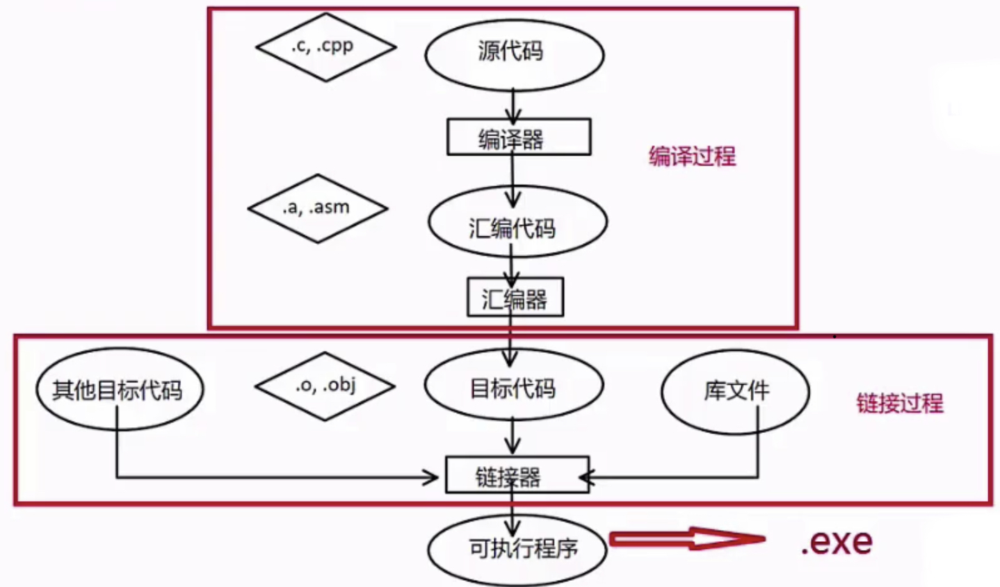
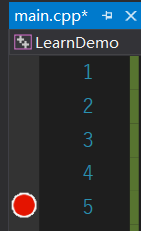
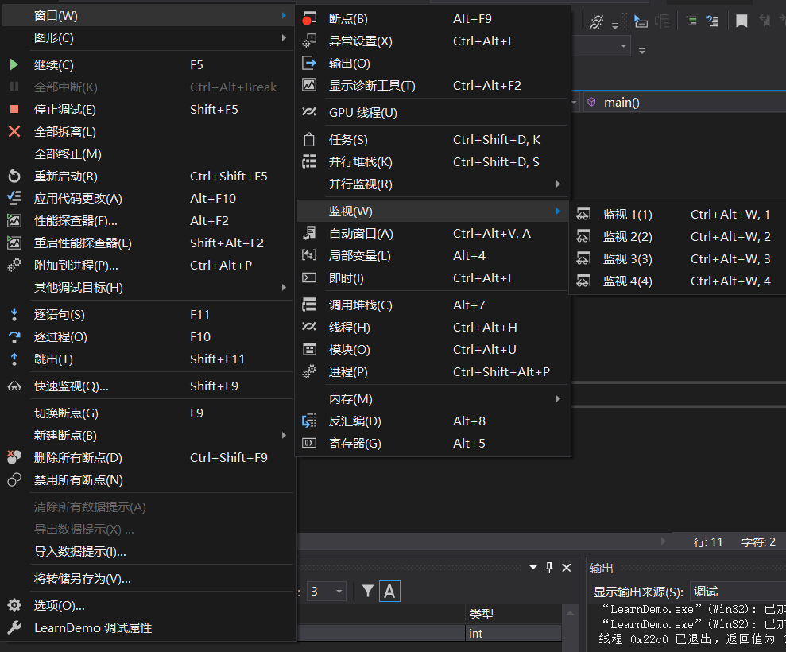

[toc]

## 第1章 C++概括

> C++的特点

- 优点：
  - 强大的抽象封装能力
  - 高性能
  - 低功耗
- 缺点
  - 语法相对复杂，细节较多
  - 需要一些好的规范和范式，否则代码难以维护


## 第2章 C++基础语法

### 2.1 编译型语言

> 编程语言的层次和类型

- 机器语言，汇编语言等；
- 编译型语言，如C，C++；
- 解释型语言，如Basic，Python等；
- 脚本语言，如bash，csh等；

从上至下适用层次更接近与人类使用，但运行效率逐渐降低

> 编译链接过程

编译型语言一般需要经历编译和链接的过程，才能变成真正的可执行的程序

编译，链接的大致过程：




### 2.2 语言的数据类型

C++中的每个变量都有其数据类型，数据类型决定这个变量所占内存空间的大小和布局方式、该空间能存储的值的范围，以及变量能参与的运算。

> 常见数据类型

[详情见C++Primer2.1.1 算数类型](./C++Primer)

> 常见数据类型的定义

```c++
char a[10] = "a";
short int s = 97;
int m = 97;
long int n = 97;
float f = 97.0f;
double d = 97.0;
long double k = 97.0;
bool b = true;
wchar_t w[10] = L "a";
```

### 2.3 开发环境的安装与使用

> 安装

按照提示进行安装即可

> 调试

- 添加断点

  

单击所选行数的位置，即会出现红色圆点,添加断点成功，再次点击断点消失

- 调试

  - 按下F5或者点击调试工具栏下的开始调试,即进入调试状态

  - 打开监视窗口可以监视变量的变化情况
  - 打开内存窗口输入变量的地址可以查看该变量内存里的值情况
  - 调试可选择逐语句或逐过程运行
  



### 2.4 语言的标识符和关键字

[百度百科：C++的关键字]([https://baike.baidu.com/item/C++%E5%85%B3%E9%94%AE%E5%AD%97/5773813](https://baike.baidu.com/item/C++关键字/5773813))

变量名字尽量使用名词或形容词+名词，函数名可以使用动词+名词

### 2.5 变量与常量

C++中有两种简单的定义常量的方法:

- 使用#define进行定义；如：#define PI 3.1415926
- 使用const；如：const double PI = 3.1415926

**尽量使用const定义变量，#define不会出现在编译期，出现出现错误时难以排错**

> 整数常量

前缀指定基数:0x或0X表示十六进制,0表示八进制，不带前缀默认为十进制

整数常量也可以带一个后缀，后缀是U和L的组合，U表示无符号整数,L表示长整数，后缀不区分大小写和顺序

> 布尔常量

true值代表真,false值代表假

> 字符常量

字符常量是括在单引号中，当变量以L（仅当大写）开头，则表示它是一个宽字符常量（如:L'x'），此时必须存储在wchar_t类型的变量中，否则它为窄字符常量，可以存储在char类型的简单变量中

字符串可以是一个普通的字符（如:'x'），一个转义序列（'\t'），或一个通用字符（'\u02C0'）

| 转义字符 | 意义                                | ASCII码值（十进制） |
| -------- | ----------------------------------- | ------------------- |
| \a       | 响铃(BEL)                           | 007                 |
| \b       | 退格(BS) ，将当前位置移到前一列     | 008                 |
| \f       | 换页(FF)，将当前位置移到下页开头    | 012                 |
| \n       | 换行(LF) ，将当前位置移到下一行开头 | 010                 |
| \r       | 回车(CR) ，将当前位置移到本行开头   | 013                 |
| \t       | 水平制表(HT) （跳到下一个TAB位置）  | 009                 |
| \v       | 垂直制表(VT)                        | 011                 |
| \\       | 代表一个反斜线字符''\'              | 092                 |
| \'       | 代表一个单引号（撇号）字符          | 039                 |
| \"       | 代表一个双引号字符                  | 034                 |
| \?       | 代表一个问号                        | 063                 |
| \0       | 空字符(NUL)                         | 000                 |
| \ddd     | 1到3位八进制数所代表的任意字符      | 三位八进制          |
| \xhh     | 十六进制所代表的任意字符            | 十六进制            |


## 第3章 C++的运算符与表达式

### 3.1 运算符表达式和基本语句

> 运算符

运算符是一种告诉编译器执行特定的数学或逻辑操作的符号，C++内置了丰富的运算符，并提供了下列类型的运算符：

- 算术运算符
- 关系运算符
- 逻辑运算符
- 位运算符
- 赋值运算符
- 杂项运算符

> 表达式

在程序中，运算符是用来操作数据的，因此，这些数据也被称为操作数，使用运算符将操作数连接而成的式子称为表达式，表达式有如下特点

- 常量和变量均为表达式
- 运算符的类型对应表达式的类型
- 每一个表达式都有自己的值

> 运算符优先级

运算符的优先级确定表达式中项的组合。这会影响到一个表达式如何计算。某些运算符比其他运算符有更高的优先级，例如，乘除运算符具有比加减运算符更高的优先级。

例如 x = 7 + 3 * 2，在这里，x 被赋值为 13，而不是 20，因为运算符 * 具有比 + 更高的优先级，所以首先计算乘法 3*2，然后再加上 7。

下表将按运算符优先级从高到低列出各个运算符，具有较高优先级的运算符出现在表格的上面，具有较低优先级的运算符出现在表格的下面。在表达式中，较高优先级的运算符会优先被计算。

| 类别       | 运算符                            | 结合性   |
| :--------- | :-------------------------------- | :------- |
| 后缀       | () [] -> . ++ - -                 | 从左到右 |
| 一元       | + - ! ~ ++ - - (type)* & sizeof   | 从右到左 |
| 乘除       | * / %                             | 从左到右 |
| 加减       | + -                               | 从左到右 |
| 移位       | << >>                             | 从左到右 |
| 关系       | < <= > >=                         | 从左到右 |
| 相等       | == !=                             | 从左到右 |
| 位与 AND   | &                                 | 从左到右 |
| 位异或 XOR | ^                                 | 从左到右 |
| 位或 OR    | \|                                | 从左到右 |
| 逻辑与 AND | &&                                | 从左到右 |
| 逻辑或 OR  | \|\|                              | 从左到右 |
| 条件       | ?:                                | 从右到左 |
| 赋值       | = += -= *= /= %=>>= <<= &= ^= \|= | 从右到左 |
| 逗号       | ,                                 | 从左到右 |

### 3.2 算术运算符

假设变量 A 的值为 10，变量 B 的值为 20，则：

| 运算符 | 描述                                                         | 实例             |
| :----- | :----------------------------------------------------------- | :--------------- |
| +      | 把两个操作数相加                                             | A + B 将得到 30  |
| -      | 从第一个操作数中减去第二个操作数                             | A - B 将得到 -10 |
| *      | 把两个操作数相乘                                             | A * B 将得到 200 |
| /      | 分子除以分母                                                 | B / A 将得到 2   |
| %      | 取模运算符，整除后的余数                                     | B % A 将得到 0   |
| ++     | [自增运算符](https://www.runoob.com/cplusplus/cpp-increment-decrement-operators.html)，整数值增加 1 | A++ 将得到 11    |
| --     | [自减运算符](https://www.runoob.com/cplusplus/cpp-increment-decrement-operators.html)，整数值减少 1 | A-- 将得到 9     |

### 3.3 关系运算符

假设变量 A 的值为 10，变量 B 的值为 20，则：

| 运算符 | 描述                                                         | 实例              |
| :----- | :----------------------------------------------------------- | :---------------- |
| ==     | 检查两个操作数的值是否相等，如果相等则条件为真。             | (A == B) 不为真。 |
| !=     | 检查两个操作数的值是否相等，如果不相等则条件为真。           | (A != B) 为真。   |
| >      | 检查左操作数的值是否大于右操作数的值，如果是则条件为真。     | (A > B) 不为真。  |
| <      | 检查左操作数的值是否小于右操作数的值，如果是则条件为真。     | (A < B) 为真。    |
| >=     | 检查左操作数的值是否大于或等于右操作数的值，如果是则条件为真。 | (A >= B) 不为真。 |
| <=     | 检查左操作数的值是否小于或等于右操作数的值，如果是则条件为真。 | (A <= B) 为真。   |

### 3.4 逻辑运算符

假设变量 A 的值为 1，变量 B 的值为 0，则：

| 运算符 | 描述                                                         | 实例              |
| :----- | :----------------------------------------------------------- | :---------------- |
| &&     | 称为逻辑与运算符。如果两个操作数都非零，则条件为真。         | (A && B) 为假。   |
| \|\|   | 称为逻辑或运算符。如果两个操作数中有任意一个非零，则条件为真。 | (A \|\| B) 为真。 |
| !      | 称为逻辑非运算符。用来逆转操作数的逻辑状态。如果条件为真则逻辑非运算符将使其为假。 | !(A && B) 为真。  |

[断言（assert）的用法](https://www.runoob.com/w3cnote/c-assert.html)

### 3.5 位运算符

位运算符作用于位，并逐位执行操作。&、 | 和 ^ 的真值表如下所示：

| p    | q    | p & q | p \| q | p ^ q |
| :--- | :--- | :---- | :----- | :---- |
| 0    | 0    | 0     | 0      | 0     |
| 0    | 1    | 0     | 1      | 1     |
| 1    | 1    | 1     | 1      | 0     |
| 1    | 0    | 0     | 1      | 1     |

假设变量 A 的值为 60，变量 B 的值为 13，则：

| 运算符 | 描述                                                         | 实例                                                         |
| :----- | :----------------------------------------------------------- | :----------------------------------------------------------- |
| &      | 如果同时存在于两个操作数中，二进制 AND 运算符复制一位到结果中。 | (A & B) 将得到 12，即为 0000 1100                            |
| \|     | 如果存在于任一操作数中，二进制 OR 运算符复制一位到结果中。   | (A \| B) 将得到 61，即为 0011 1101                           |
| ^      | 如果存在于其中一个操作数中但不同时存在于两个操作数中，二进制异或运算符复制一位到结果中。 | (A ^ B) 将得到 49，即为 0011 0001                            |
| ~      | 二进制补码运算符是一元运算符，具有"翻转"位效果，即0变成1，1变成0。 | (~A ) 将得到 -61，即为 1100 0011，一个有符号二进制数的补码形式。 |
| <<     | 二进制左移运算符。左操作数的值向左移动右操作数指定的位数。   | A << 2 将得到 240，即为 1111 0000                            |
| >>     | 二进制右移运算符。左操作数的值向右移动右操作数指定的位数。   | A >> 2 将得到 15，即为 0000 1111                             |

### 3.6 赋值运算符

| 运算符 | 描述                                                         | 实例                            |
| :----- | :----------------------------------------------------------- | :------------------------------ |
| =      | 简单的赋值运算符，把右边操作数的值赋给左边操作数             | C = A + B 将把 A + B 的值赋给 C |
| +=     | 加且赋值运算符，把右边操作数加上左边操作数的结果赋值给左边操作数 | C += A 相当于 C = C + A         |
| -=     | 减且赋值运算符，把左边操作数减去右边操作数的结果赋值给左边操作数 | C -= A 相当于 C = C - A         |
| *=     | 乘且赋值运算符，把右边操作数乘以左边操作数的结果赋值给左边操作数 | C *= A 相当于 C = C * A         |
| /=     | 除且赋值运算符，把左边操作数除以右边操作数的结果赋值给左边操作数 | C /= A 相当于 C = C / A         |
| %=     | 求模且赋值运算符，求两个操作数的模赋值给左边操作数           | C %= A 相当于 C = C % A         |
| <<=    | 左移且赋值运算符                                             | C <<= 2 等同于 C = C << 2       |
| >>=    | 右移且赋值运算符                                             | C >>= 2 等同于 C = C >> 2       |
| &=     | 按位与且赋值运算符                                           | C &= 2 等同于 C = C & 2         |
| ^=     | 按位异或且赋值运算符                                         | C ^= 2 等同于 C = C ^ 2         |
| \|=    | 按位或且赋值运算符                                           | C \|= 2 等同于 C = C \| 2       |

### 3.7 杂项运算符

| 运算符               | 描述                                                         |
| :------------------- | :----------------------------------------------------------- |
| sizeof               | [sizeof 运算符](https://www.runoob.com/cplusplus/cpp-sizeof-operator.html)返回变量的大小。例如，sizeof(a) 将返回 4，其中 a 是整数。 |
| Condition ? X : Y    | [条件运算符](https://www.runoob.com/cplusplus/cpp-conditional-operator.html)。如果 Condition 为真 ? 则值为 X : 否则值为 Y。 |
| ,                    | [逗号运算符](https://www.runoob.com/cplusplus/cpp-comma-operator.html)会顺序执行一系列运算。整个逗号表达式的值是以逗号分隔的列表中的最后一个表达式的值。 |
| .（点）和 ->（箭头） | [成员运算符](https://www.runoob.com/cplusplus/cpp-member-operators.html)用于引用类、结构和共用体的成员。 |
| Cast                 | [强制转换运算符](https://www.runoob.com/cplusplus/cpp-casting-operators.html)把一种数据类型转换为另一种数据类型。例如，int(2.2000) 将返回 2。 |
| &                    | [指针运算符 &](https://www.runoob.com/cplusplus/cpp-pointer-operators.html) 返回变量的地址。例如 &a; 将给出变量的实际地址。 |
| *                    | [指针运算符 *](https://www.runoob.com/cplusplus/cpp-pointer-operators.html) 指向一个变量。例如，*var; 将指向变量 var。 |


### 3.8 补码

> 计算补码的方法

- 对正数：直接按位计算权重和
- 对负数：保留符号位，对后面每位取反加一

> 字节序

一个字（32位机器采用32bits字长4bytes）在内存中以byte存放的方式：


如：若表示的数其补码为 80 00 00 00， 7f ff ff ff，那么在计算机中若以小端法表示存储为 00 00 00 80， ff ff ff 7f

[理解字节序](http://www.ruanyifeng.com/blog/2016/11/byte-order.html)

> 关于位运算的一点补充说明

- 左移：每一位左移，最后一位补0
- 右移：存在两种情况
  - 逻辑右移：最高位填充为0
  - 算术右移：移走的位填充与符号有关，负数填充1，其他填充0

因此对于有符号的数，尽可能不要使用右移运算，因为右移运算的方式取决于编译器

## 第4章 C++基础容器

### 4.1 序列容器--数组

> off-by-one error数组下标

off-by-one error （差一错误）

数组中通过左闭右开的方式可以避免上述错误，如：

```c++
for (int i = 0; i <10 ; i++) {
    cout << a[i] << endl;
}
```

> 数组设计的原则

从0开始，使用非对称空间：

让下界（左侧）可以取到值，让上界（右侧）取不到值；

好处：

- 取值范围的大小：上界-下界
- 如果取值范围为空，上界值==下界值
- 及时取值范围为空上界值也永远不可能小于下界值

### 4.2 数组的增删改查及二维数组


> 二维数组设计的tips（循环时尽可能要满足空间局限性）

- 在一个小的时间窗口内，访问的变量地址越接近越好，这样执行速度快
- 一般来说，需要将最长的循环放最内层，最短的循环放在最外层，以减少CPU跨层的次数

### 4.3 动态数组vector

> 使用前的准备（引入头文件和namespace）

```c++
#include <vector>
using namespace std;
```

> 相关方法

```c++
vector<int> vec = {1, 2, 3};
//在尾部插入元素
vec.push_back(4);
//在中间进行元素插入
vec.insert(vec.end()-1, 4); //在尾部前一个位置插入4
//删除尾部元素
vec.pop_back();
//删除中间元素
vec.erase(vec.end()-1); //删除尾部前一个位置的元素
//获取当前容量
vec.capacity();
//获取已经存储的元素个数
vec.size();
```

### 4.4 字符串

> 字符串变量

- 字符串是以空字符（'\0'）结束的字符数组
- 空字符自动添加到字符串的内部表示中
- 在声明字符串变量时，应该位这个空结束符预留一个额外元素的空间，如：char s [11] = {"helloworld"} ;

> Unicode编码

Unicode编码：最初的目的是把世界上的文字都映射到一套字符空间中

- UTF-8
- UTF-16
  - UTF-16BE
  - UTF-16LE
- UTF-32
  - UTF-32BE
  - UTF-32LE

编码错误的根本原因在于编码方式和解码方式的不统一

Windows的文件可能有BOM（byte order mark），如果要在其他平台使用，可以去掉BOM

> 字符串的指针表示

指针所指的区域能否改变取决于指针指向的那块区域是否为可变的，如若指向的为常量，则不可变，而若指向的区域为变量，那么可以改变

字符串数组数组名定义了之后就不可变，但是数组里的值可变，而定义一个指针，指针变量的值是可变的，但是若其指向的为常量，那么则指针指向的字符串的值不可变

> 字符串的基本操作

包含在头文件<string.h>中

1. 字符串长度：strlen(s)

   返回字符串s的长度（s的长度不包括 ' \0 '）

   区别sizeof()，sizeof()计算的为占用的空间，strlen()计算的为字符串长度

2. 字符串比较：strcmp(s1, s2)

   若s1和s2 是相同的，则返回0；

   若s1 < s2 则返回值小于0；

   若s1 > s2 则返回值大于0

3. 字符串拷贝：strcpy(s1, s2)

   复制字符串s2到字符串s1

4. 复制指定长度字符串：strncpy(s1, s2, n)

   将字符串s2中前n个字符串拷贝到s1中

5. 字符串拼接：strcat(s1, s2)

   将字符串s2拼接到s1之后

6. 查找字符串：strchr(s1, ch)

   指向字符串s1中字符ch的第一次出现的位置

7. 查找字符串：strstr(s1, s2)

   指向字符串s1中字符串s2的第一次出现的位置

进行底层操作时，为避免编译器错误发出报错，可添加宏：_CRT_SECURE_NO_WARNINGS

> 缓冲区溢出问题

举例：在进行字符串拼接的操作时，若拼接长度过大而超出原本的长度，那么就有可能把存储区原本存储的信息改变，造成逻辑的改变

解决方法：养成进行边界判断的习惯，另外也存在更安全的API可供调用，如strcpy()更为安全的版本为strcpy_s()，其他几个字符串操作函数的安全版本均为*_s()，例如strcat_s(s1, size, s2,)，当s2的长度大于size时，那么会报错，无法运行

> string简介

```c++
#include<string>
using namespace std;

//定义字符串变量
string s;//定义空字符串
string s = "helloworld";//定义并初始化
string s ( "helloworld" );
string s = string( "helloworld" );
```

字符串相关函数：

- 获取字符串的长度

  ```c++
  s.length()//字符串长度
  s.size()//同上
  s.capacity()//字符串s所占空间大小
  ```

- 字符串比较：= =     ! =     >     > =     <     < =

  ```c++
  string s1 = "hello", s2 = "world";
  cout << (s1 == s2) << endl;//返回0
  cout << (s1 != s2) << endl;//返回1
  ```

字符串的常用操作：

```c++
//转换为C风格的字符串
const char *c_str1 = s1.c_str();
//随机访问（获取字符串中某个字符）：[]
string s = "hello";
cout << s[0] << endl;
//字符串拷贝：=
string s1 = "hello";
string s2 = s1;
//字符串拷贝：+、+=
string s1 = "hello", s2 = "world";
string s3 = s1 + s2;//s3:helloworld
s1 += s2;//s1:helloworld
```

总结：string结合了C++的新特性，使用起来比原始的C风格更安全和方便，对性能要求不是特别高的常见情况可以使用

## 第5章 彻底学会 C++ 指针，引用


## 第6章 C++基础句法

## 第7章 C++高级语法

## 第8章 C++编程思想

## 第9章 C++进阶编程

## 第10章 桌面应用项目实战：设计项目的架构和标准

## 第11章 实现项目《慕影》的通用组件模块

## 第12章 《慕影》播放器UI模块开发

## 第13章 实现《慕影》音视频模块开发

## 第14章 《慕影》播放器项目总结

## 第15章 C++的陷阱和经验

## 第16章 课程总结