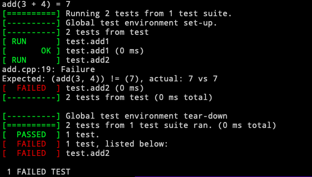

# 1. 项目下载及编译

> 从GitHub将项目克隆至本地

```
$ git clone https://github.com/google/googletest.git
```

> 进入项目文件夹并编译

```
$ cd googletest
$ mkdir build
$ cd build
$ cmake ../
$ make
```

执行完上述命令后在项目文件夹的 ./build/路径下有一个lib文件夹，在 ./googletest文件夹中有include文件夹，将这两个文件夹放入同一新建的文件夹中，

```
$ cp -R 文件夹 目标路径（相对路径或绝对路径均可）
```

# 2. 初识GoogleTest框架

> 以加法为例通过googletest对其进行测试

```c++
#include <iostream>
#include <gtest/gtest.h>

int add(int a, int b) {
    return a + b;
}

TEST(test, add1) {
    EXPECT_EQ(add(3, 4), 7);//== 
    EXPECT_NE(add(3, 4), 6);//!= 
    EXPECT_LT(add(3, 4), 8);//< 
    EXPECT_LE(add(3, 4), 7);//<=
    EXPECT_GT(add(3, 4), 6);//>
    EXPECT_GE(add(3, 4), 7);//>=
}

TEST(test, add2) {
    EXPECT_EQ(add(3, 4), 7);//== 
    EXPECT_NE(add(3, 4), 7);//!= 
    EXPECT_LT(add(3, 4), 8);//< 
    EXPECT_LE(add(3, 4), 7);//<=
    EXPECT_GT(add(3, 4), 6);//>
    EXPECT_GE(add(3, 4), 7);//>=
}
int main() {
    printf("add(3 + 4) = %d\n", add(3, 4));
    testing::InitGoogleTest();
    return RUN_ALL_TESTS();
}
```

> 编译链接

```
$ g++ -std=c++11 -I./include -L./lib add.cpp -lgtest
```

> 运行

```
$ ./a.out
```



# 3. printf输出彩色文字

> 属性代码

```c++
\033[ A1; A2; A3; ...An m
```

> 部分格式代码 

| 通用格式控制 |     功能     | 前景色 | 功能 | 背景色 | 功能 |
| :----------: | :----------: | :----: | :--: | :----: | :--: |
|      0       | 重置所有属性 |   30   | 黑色 |   40   | 黑色 |
|      1       |  高亮/加粗   |   31   | 红色 |   41   | 红色 |
|      2       |     暗淡     |   32   | 绿色 |   42   | 绿色 |
|      4       |    下划线    |   33   | 黄色 |   43   | 黄色 |
|      5       |     闪烁     |   34   | 蓝色 |   44   | 蓝色 |
|      7       |     反转     |   35   | 品红 |   45   | 品红 |
|      8       |     隐藏     |   36   | 青色 |   46   | 青色 |

> 颜色格式控制示例

```c++
printf("\033[0;1;33;41mHelloWorld!\033[0m\n");
```

颜色格式控制应前后均进行重置处理，即防止受到其他代码中设置的属性干扰，同时设置的属性干扰后续代码。

# 4. 预处理命令

## 4.1 预处理命令--宏定义

> 样例

```c++
//定义符号常量
#define PI 3.1415926
#define MAX_N 10000

//定义傻瓜表达式
#define MAX(a, b) (a) > (b) ? (a) : (b)
#define S(a, b) a * b

//定义代码段
#define P(a) { \
	 printf("%d\n", a); \
}
```

宏：简单替换

决定代码功能的并非源代码，而是预处理后的待编译源码

> 待编译源码

待编译源码的查看（> output.cpp将预处理结果结果输出到output.cpp中）

```
$ g++ -E xxx.cpp > output.cpp
```

深刻理解简单替换

```c++
#define S(a, b) a * b

int n;
S(int, p) = &n; //等价于int * p = &n;
S(1 + 2, 3); //等价于1 + 2 * 3
```

> 内置部分宏

| 宏                      | 说明                    |
| ----------------------- | ----------------------- |
| \_\_DATA\_\_            | 日期：Mmm dd yyyy       |
| \_\_TIME\_\_            | 时间：hh:mm:ss          |
| \_\_LINE\_\_            | 行号                    |
| \_\_FILE\_\_            | 文件名                  |
| \_\_func\_\_            | 函数名/非标准           |
| \_\_FUNC\_\_            | 函数名/非标准           |
| \_\_PRETTY_FUNCTION\_\_ | 更详细的函数信息/非标准 |

非标准的宏表示不一定适用所使用的环境

> LOG日志信息实现

```c++
#define LOG(frm, args...) { \
		printf("[%s : %d : %s]", __FILE__, __LINE__, __func__); \
		printf(frm, ##args); \
		printf("\n"); \
}

LOG("HelloWorld!");
```

##作用是将args与frm粘接在一起，允许后面参数为空

## 4.2 预处理命令--条件式编译

条件式编译：简单的代码剪裁

| 函数            | 说明                 |
| --------------- | -------------------- |
| #ifdef DEBUG    | 是否定义了DEBUG宏    |
| #ifndef DEBUG   | 是否没定义DEBUG宏    |
| #if MAX_N == 5  | 宏MAX_N是否等于5     |
| #elif MAX_N ==4 | 否则宏MAX_N是否等于4 |
| #else           |                      |
| #endif          |                      |

> 对LOG调试信息是否输出进行控制

```c++
#ifdef DEBUG

#define LOG(frm, args...) { \
		printf("[%s : %d : %s]", __FILE__, __LINE__, __func__); \
		printf(frm, ##args); \
		printf("\n"); \
}

#else

#define LOG(frm, args...)

#endif

LOG("HelloWorld!");
```

若需要打开LOG，在ifdef前加上#define DEBUG即可，或者编译时添加参数-DDEBUG进行打开

# 5. GoogleTest框架部分功能的实现

> 实现EXPECT封装

```c++
#define EXPECT(a, comp, b) { \
		if (!(a) comp (b)) { \
      printf("error\n"); \
    } \
}
#define EXPECT_EQ(a, b) EXPECT(a, ==, b)
#define EXPECT_NE(a, b) EXPECT(a, !=, b)
#define EXPECT_LT(a, b) EXPECT(a, <, b)
#define EXPECT_LE(a, b) EXPECT(a, <=, b)
#define EXPECT_GT(a, b) EXPECT(a, >, b)
#define EXPECT_GE(a, b) EXPECT(a, >=, b)
```

> 实现COLOR系列封装

```c++
#define COLOR(msg, code) "\033[0;1;" #code "m" msg "\033[0m"

#define RED(msg) COLOR(msg, 31)
#define GREEN(msg) COLOR(msg, 32)
#define YELLOW(msg) COLOR(msg, 33)
#define BLUE(msg) COLOR(msg, 34)
```

其他颜色同理

> 使用\_\_attribute\_\_完成函数注册功能

主函数不一定是程序的入口。

```c++
#include <iostream>
using namespace std;

__attribute__((constructer))
void test() {
  printf("%s : hello world\n", __func__);
  return;
}

int main() {
  printf("%s : helloworld\n", __func__);
  return 0;
}
```

上述程序的执行test函数先于主函数执行。

> 完善功能：测试框架初养成

```c++
#define COLOR(msg, code) "\033[0;1;" #code "m" msg "\033[0m"
#define RED(msg)    COLOR(msg, 31)
#define GREEN(msg)  COLOR(msg, 32)
#define YELLOW(msg) COLOR(msg, 33)
#define BLUE(msg)   COLOR(msg, 34)

#define EXPECT(a, comp, b) { \
    __typeof(a) __a = (a), __b = (b); \
    if (!((__a) comp (__b))) { \
        printf(YELLOW("  %s:%d: Failure\n"), __FILE__, __LINE__); \
        printf(YELLOW("    Expected: (%s) %s (%s), actual: %d vs %d\n"),\
        #a, #comp, #b, __a, __b); \
    } \
}
#define EXPECT_EQ(a, b) EXPECT(a, ==, b)
#define EXPECT_NE(a, b) EXPECT(a, !=, b)
#define EXPECT_LT(a, b) EXPECT(a, <, b)
#define EXPECT_LE(a, b) EXPECT(a, <=, b)
#define EXPECT_GT(a, b) EXPECT(a, >, b)
#define EXPECT_GE(a, b) EXPECT(a, >=, b)

#define TEST(a, b) \
void a##_##b(); \
__attribute__((constructor)) \
void reg_##a##_##b() { \
    add_func(a##_##b, #a "." #b); \
    return ; \
} \
void a##_##b()

struct {
    void (*func)();
    const char *func_name;
} func_arr[100];
int func_cnt = 0;

void add_func(void (*func)(), const char *str) {
    func_arr[func_cnt].func = func;
    func_arr[func_cnt].func_name = str;
    func_cnt += 1;
    return ;
}

int RUN_ALL_TESTS() {
    for (int i = 0; i < func_cnt; i++) {
        printf(GREEN("[  RUN    ]") " %s\n", func_arr[i].func_name);
        func_arr[i].func();
    }
    return 0;
}

#endif
```

