## 0

### 0-1 绪论

> 机构和机器的区别

机构仅是一个构件系统，而机器还包括电气、液压等其他装置；
机构侧重运动和力的传递，而机器还有变换和传递能量、物料、信息的功能。

构件（运动的单元），零件（制造的单元）

>机械产品设计的基本要求

1.良好的使用性能
2.安全、可靠
3.满足经济性要求
4.操作方便
5.造型美观、减少污染

>机械产品设计的一般过程

1.需求分析-> 2.的定工艺方案-> 3.确定工艺参数-> 4.机械方案设计-> 5.机械方案运动分
--> 6.机械方案动力分析-> 7.机械工作能力设计-> 8.机械结构设计-> 9.机械造型设计

## 1

### 1-1 运动副及其分类

构件：机构中运动的单元
运动副：两个构件直接接触且具有确定相对运动的联接（分为平面运动副和空间运动副）
运动副元素：两构件相互接触处的几何形状（点、线、面）

>平面运动副

- 转动副
- 移动副

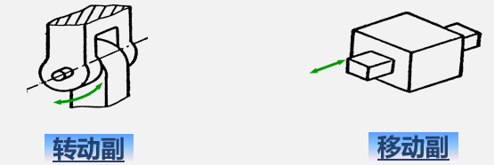

特点：
- 低副：面接触、相对转动或相对移动
- 高副：点或线接触、沿接触点切线方向相对移动和绕接触点的转动

>空间运动副

- 螺旋副
- 球面副

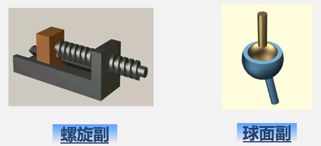

> 运动链

运动链：若干构件通过运动副联接而成的可动系统。

若将运动链中的一个构件相对固定，运动链则成为机构。

>机构中构件的分类

- 机架（描述运动的参考系）
- 原动件（运动规律已知的构件）
- 从动件

### 1-2 平面机构运动简图的绘制

在研究机构运动时，为了使问题简化，有必要撇开那些与运动无关的构件外形和运动副具体构造，仅用简单的线条和符号来表示构件和运动副，并按比例定出各运动副的位置。这种说明机构各构件间关系的简化图形，称为机构运动简图。它与原机构具有完全相同的运动特性

与运动相关的因素：
- 构件数目、运动副数目及类型
- 运动副之间的相对位置

表达方式：
- 用简单线条表示构件
- 规定符号代表运动副
- 按比例定出运动副的相对位置

用途：分析现有机构，构思设计新机械  

>运动副符号

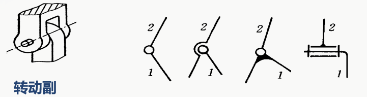
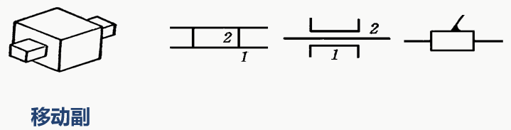
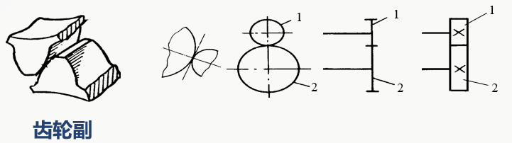
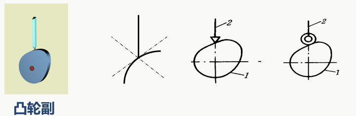

> 构件

不管构件形状如何，简单线条表示，带短剖面线表示机架。

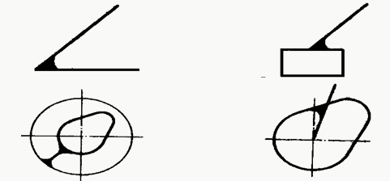
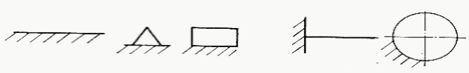

> 机构运动简图的绘制

1.确定构件数目及原动件、输出构件；
2.根据各构件间的相对运动确定运动副的种类和数目；
3.选定比例尺，按规定符号绘制运动简图；
4.标明机架、原动件和作图比例尺；
5.验算自由度。

顺口溜：先两头，后中间，从头到尾走一遍，数数构件是多少，再看它们怎相联

### 1-3 平面机构自由度的计算

>构件的自由度

自由度：构件所具独立运动的个数（确定构件位置所需独立坐标数）

一个完全自由的平面运动构件具有三个自由度。自由度  F = 3

>平面运动副的约束条件

运动副的形成引入了约束，使构件失去运动自由度

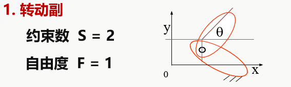

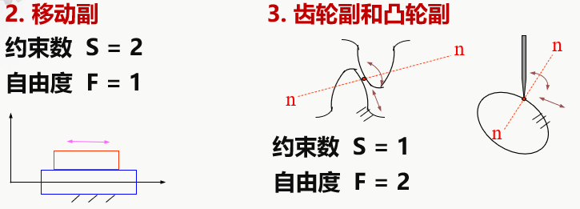

> 机构自由度的计算公式

机构的自由度 F = 3 * 活动构件数 - 2 * 低副数 - 1 * 高副数

三个构件通过三个转动副相连, 相当于一个构件。

>机构(运动链)具有确定相对运动的条件

- 有一个机架
- 自由度大于零（F>0）
- 原动件数 =自由度数（通常，原动件为含低副构件且与机架相连，只有一个自由度。）

>注意事项

- 复合铰链
m个构件(m>=3)在同一处构成共轴线的转动副应当包含m-1个转动副（低副）
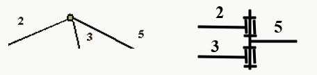

   如：
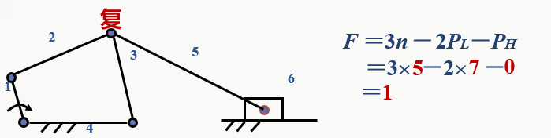

- 局部自由度
机构中某些构件所具有的局部运动，并不影响机构运动的自由度
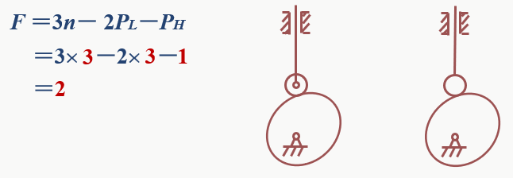

- 虚约束
不产生实际约束效果的重复约束

例：

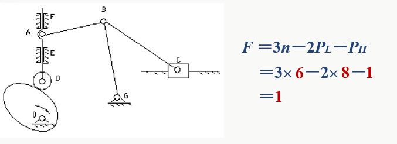

## 2

### 2-1 平面四杆机构的基本类型及其应用

>特点

全低副（面接触），有利于润滑、磨损小等特点；
所有的构件均为杆件结构。

>特点

1. 近似运动规律的实现；
2. 给定点近似运动轨迹实现的

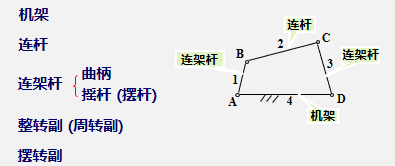

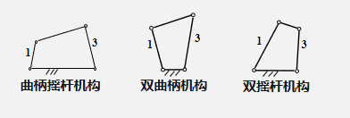

曲柄：能够整周地转动
摇杆：（摆杆）

> 有一个移动副的四杆机构

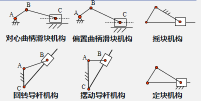

> 有两个移动副的四杆机构

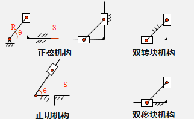

### 2-2 平面四杆机构的基本特性

> 平面四杆机构的基本特性一

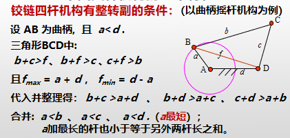

结论：
- 最短杆与最长杆长度之和小于或等于其余两杆长度之和
- 整转副是由最短杆与其相邻杆组成

推论1：
当Lmax+LminL(其余两杆长度之和)时
         最短杆是连架杆--曲柄摇杆机构
         最短杆是机架--双曲柄机构
         最短杆是连杆--双摇杆机构

推论2：
当Lmax+Lmin>L(其余两杆长度之和)时双摇杆机构，同时机构没有整转副

>平面四杆机构的基本特性2

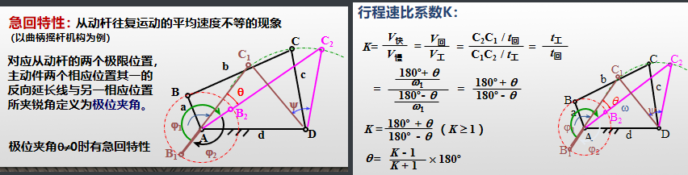

>压力角和传动角

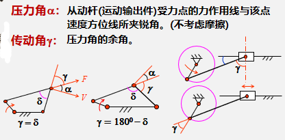

> 死点位置

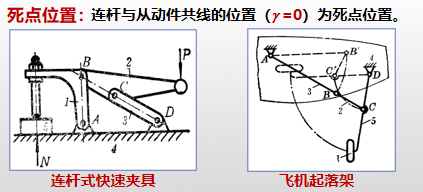

实例：
- 曲柄摇杆机构（摇杆为主动件）有死点位置
- 曲柄滑块机构（滑块为主动件）有死点位置
- 摆动导杆机构（导杆为主动件）有死点位置

### 2-3 典型平面连杆机构实例分析

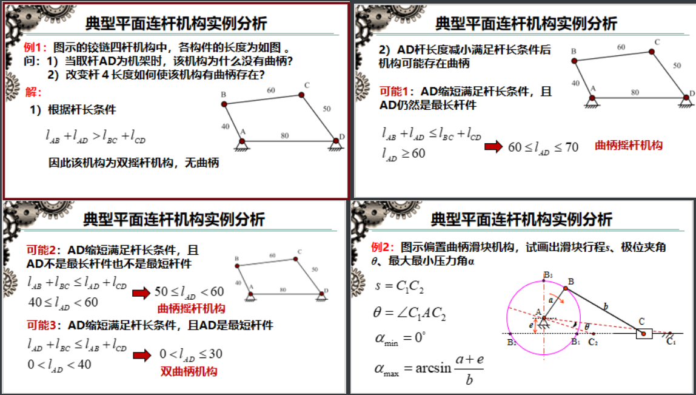

## 3

### 3-1 凸轮机构的应用和类型

凸轮机构：主要由凸轮、从动件和机架三部分组成
作用：实现从动件往复运动或摆动任意运动规律

>按凸轮的形状分类

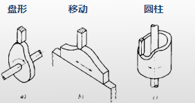

> 按从动件运动形式分

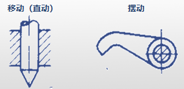

> 按从动件形状分

> 凸轮廓线及名称

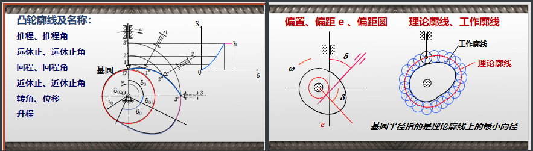

### 3-2 凸轮机构从动件运动规律和凸轮机构压力角

> 等速运动规律（直线位移运动规律、一次多项式运动规律）

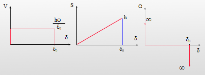

特点：设计简单、匀速进给、amax 最小。始点、末点有刚性冲击

> 简谐运动规律（余弦加速度运动规律）

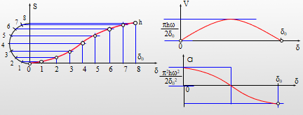

特点：加速度变化连续平缓，始、末点有柔性冲击

> 正弦加速度运动规律（摆线投影位移运动规律）

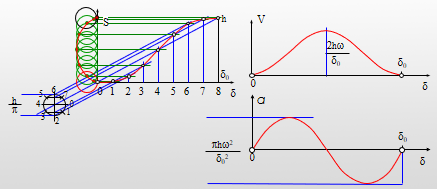

特点：加速度变化连续，无冲击

> 凸轮机构的压力角

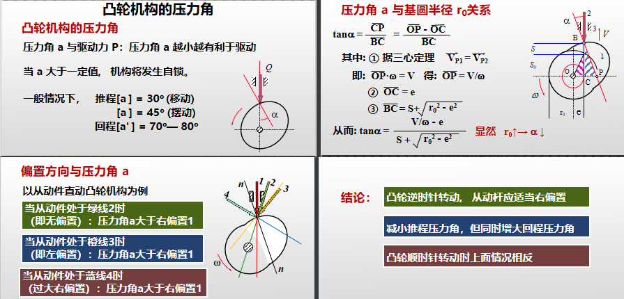

