## 0

### 0-1 绪论

> 机构和机器的区别

机构仅是一个构件系统，而机器还包括电气、液压等其他装置；
机构侧重运动和力的传递，而机器还有变换和传递能量、物料、信息的功能。

构件（运动的单元），零件（制造的单元）

>机械产品设计的基本要求

1.良好的使用性能
2.安全、可靠
3.满足经济性要求
4.操作方便
5.造型美观、减少污染

>机械产品设计的一般过程

1.需求分析-> 2.的定工艺方案-> 3.确定工艺参数-> 4.机械方案设计-> 5.机械方案运动分
--> 6.机械方案动力分析-> 7.机械工作能力设计-> 8.机械结构设计-> 9.机械造型设计

## 1

### 1-1 运动副及其分类

构件：机构中运动的单元
运动副：两个构件直接接触且具有确定相对运动的联接（分为平面运动副和空间运动副）
运动副元素：两构件相互接触处的几何形状（点、线、面）

>平面运动副

- 转动副
- 移动副

特点：
- 低副：面接触、相对转动或相对移动
- 高副：点或线接触、沿接触点切线方向相对移动和绕接触点的转动

>空间运动副

- 螺旋副
- 球面副

> 运动链

运动链：若干构件通过运动副联接而成的可动系统。

若将运动链中的一个构件相对固定，运动链则成为机构。

>机构中构件的分类

- 机架（描述运动的参考系）
- 原动件（运动规律已知的构件）
- 从动件

### 1-2 平面机构运动简图的绘制

在研究机构运动时，为了使问题简化，有必要撇开那些与运动无关的构件外形和运动副具体构造，仅用简单的线条和符号来表示构件和运动副，并按比例定出各运动副的位置。这种说明机构各构件间关系的简化图形，称为机构运动简图。它与原机构具有完全相同的运动特性

与运动相关的因素：
- 构件数目、运动副数目及类型
- 运动副之间的相对位置

表达方式：
- 用简单线条表示构件
- 规定符号代表运动副
- 按比例定出运动副的相对位置

用途：分析现有机构，构思设计新机械  

>运动副符号

> 构件

不管构件形状如何，简单线条表示，带短剖面线表示机架。

> 机构运动简图的绘制

1.确定构件数目及原动件、输出构件；
2.根据各构件间的相对运动确定运动副的种类和数目；
3.选定比例尺，按规定符号绘制运动简图；
4.标明机架、原动件和作图比例尺；
5.验算自由度。

顺口溜：先两头，后中间，从头到尾走一遍，数数构件是多少，再看它们怎相联

### 1-3 平面机构自由度的计算

>构件的自由度

自由度：构件所具独立运动的个数（确定构件位置所需独立坐标数）

一个完全自由的平面运动构件具有三个自由度。自由度  F = 3

>平面运动副的约束条件

运动副的形成引入了约束，使构件失去运动自由度

> 机构自由度的计算公式

机构的自由度 F = 3 * 活动构件数 - 2 * 低副数 - 1 * 高副数

三个构件通过三个转动副相连, 相当于一个构件。

>机构(运动链)具有确定相对运动的条件

- 有一个机架
- 自由度大于零（F>0）
- 原动件数 =自由度数（通常，原动件为含低副构件且与机架相连，只有一个自由度。）

>注意事项

- 复合铰链
m个构件(m>=3)在同一处构成共轴线的转动副应当包含m-1个转动副（低副）

   如：

- 局部自由度
机构中某些构件所具有的局部运动，并不影响机构运动的自由度

- 虚约束
不产生实际约束效果的重复约束
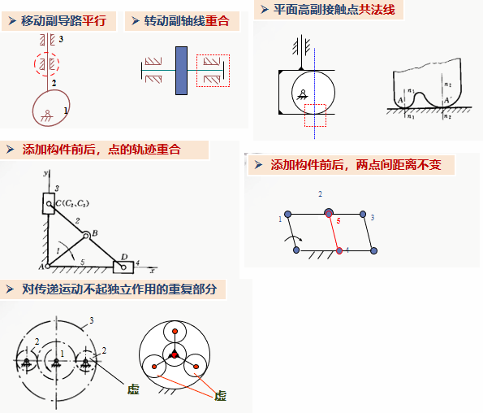

例：

## 2

### 2-1 平面四杆机构的基本类型及其应用

>特点

全低副（面接触），有利于润滑、磨损小等特点；
所有的构件均为杆件结构。

>特点

1. 近似运动规律的实现；
2. 给定点近似运动轨迹实现的

曲柄：能够整周地转动
摇杆：（摆杆）

> 有一个移动副的四杆机构

> 有两个移动副的四杆机构

### 2-2 平面四杆机构的基本特性

> 平面四杆机构的基本特性一

结论：
- 最短杆与最长杆长度之和小于或等于其余两杆长度之和
- 整转副是由最短杆与其相邻杆组成

推论1：
当Lmax+Lmin<=L(其余两杆长度之和)时
         最短杆是连架杆--曲柄摇杆机构
         最短杆是机架--双曲柄机构
         最短杆是连杆--双摇杆机构

推论2：
当Lmax+Lmin>L(其余两杆长度之和)时双摇杆机构，同时机构没有整转副

>平面四杆机构的基本特性2

>压力角和传动角

> 死点位置

实例：
- 曲柄摇杆机构（摇杆为主动件）有死点位置
- 曲柄滑块机构（滑块为主动件）有死点位置
- 摆动导杆机构（导杆为主动件）有死点位置

### 2-3 典型平面连杆机构实例分析

## 3

### 3-1 凸轮机构的应用和类型

凸轮机构：主要由凸轮、从动件和机架三部分组成
作用：实现从动件往复运动或摆动任意运动规律

>按凸轮的形状分类

> 按从动件运动形式分

> 按从动件形状分

> 凸轮廓线及名称

### 3-2 凸轮机构从动件运动规律和凸轮机构压力角

> 等速运动规律（直线位移运动规律、一次多项式运动规律）

特点：设计简单、匀速进给、amax 最小。始点、末点有刚性冲击

> 简谐运动规律（余弦加速度运动规律）

特点：加速度变化连续平缓，始、末点有柔性冲击

> 正弦加速度运动规律（摆线投影位移运动规律）

特点：加速度变化连续，无冲击

> 凸轮机构的压力角

### 3-3 图解法设计凸轮廓线

>对心尖顶移动从动杆的凸轮廓线设计（反转法原理）

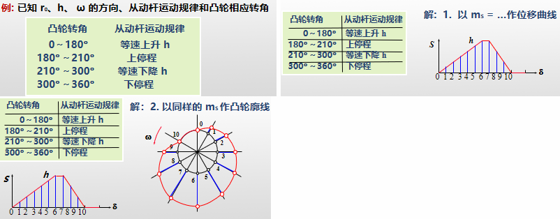

> 偏置尖顶移动从动杆的凸轮廓线设计

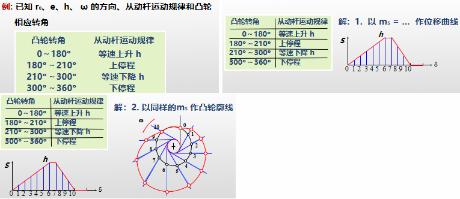

> 对心滚子移动从动杆的凸轮廓线设计

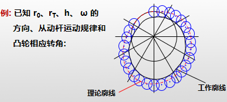

> 尖顶摆动从动杆的凸轮廓线设计

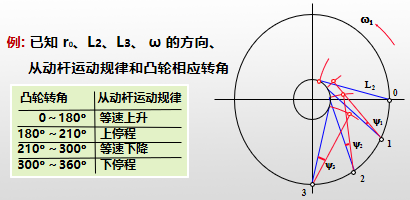

### 3-4 典型凸轮机构实例分析

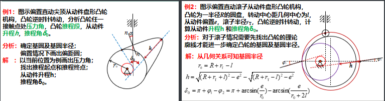

## 4

### 4-1 齿轮机构的特点和类型

结构特点：圆柱体或圆锥体上均匀分布有大小一样的轮齿
作用：传递空间任意两轴（平行、相交、交错）的旋转运动，或将转动变换为移动

>优点

- 传动比准确、传动平稳
- 圆周速度大，高达300 m/s
- 传动功率范围大，从几瓦到10万千瓦
- 效率高(η→0.99)、使用寿命长、工作安全可靠
- 可实现平行轴、相交轴和交错轴之间的传动

>缺点

- 要求较高的制造和安装精度
- 加工成本高
- 不适宜远距离传动(如单车)

> 齿轮机构的分类

- 平面齿轮机构
  - 直齿圆柱齿轮机构
  - 平行轴斜齿圆柱齿轮机构
  - 人字齿圆柱齿轮机构
- 空间齿轮机构
  - 圆锥齿轮机构
  - 交错轴斜齿轮机构

### 4-2 齿廓实现定角速度比的条件

工作原理：依靠主动轮齿推动从动轮齿实现运动的传递
啮合：两条齿廓曲线的相互接触
传动比：两轮的瞬时角速度之比（i12=w1/w2）

> 齿轮啮合的基本要求

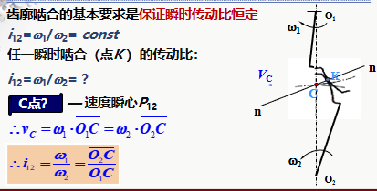

> 齿轮啮合基本定律

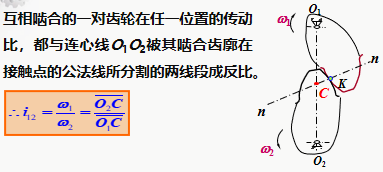

推论（定传动比的条件）：不论两齿廓在何位置接触，过接触点所作的齿廓公法线必须与两齿轮的连心线交于一固定点。

> 相关基本概念

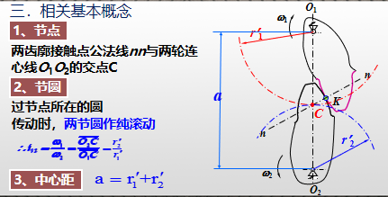

凡满足齿廓啮合定律而相互啮合的一对齿廓称为共轭齿廓

### 4-3 渐开线齿廓

> 渐开线齿廓

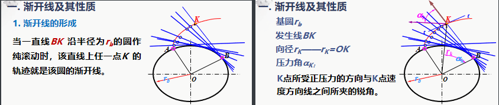

> 渐开线的性质

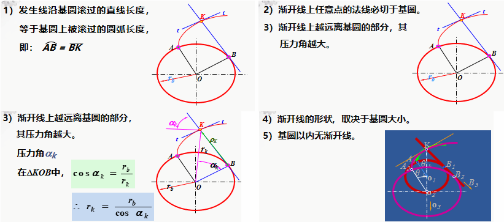

> 渐开线齿廓的啮合特性

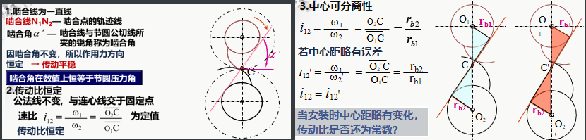

### 4-4 齿轮各部分名称及标准齿轮的基本尺寸

> 各部分名称和符号

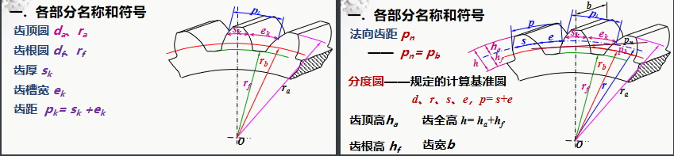
正常齿标准齿轮的主要尺寸：（10个）4个圆、3个高、3个距

> 齿轮基本参数

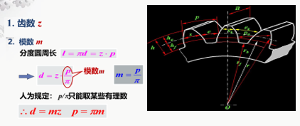

模数是决定齿轮尺寸的一个基本参数。
齿数相同的齿轮，模数大，尺寸也大。

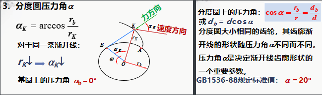

> 主要尺寸计算公式

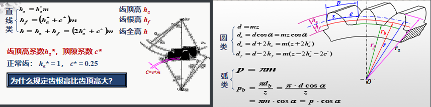

> 重要概念

分度圆：齿轮上具有标准模数和标准压力角的圆
任一齿轮都有一分度圆，且只有一个分度圆

与节圆的区别

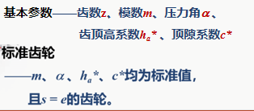

### 4-5 渐开线标准齿轮的啮合

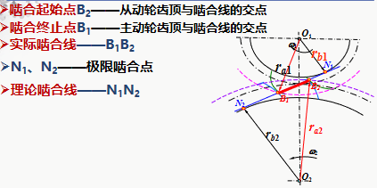

> 正确啮合条件

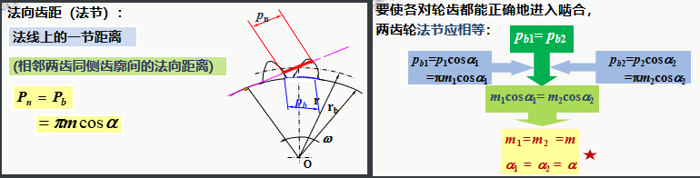

一对齿轮的正确啮合条件：两轮的模数和压力角应分别相等

> 无侧隙啮合传动及标准安装

无侧隙啮合：一个齿轮的齿厚与其相啮合的另一个齿轮的齿槽在两条啮合线上均紧密相切接触
无侧隙啮合传动条件：一个齿轮的节圆齿厚必须等于另一个齿轮的节圆齿槽宽。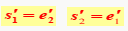

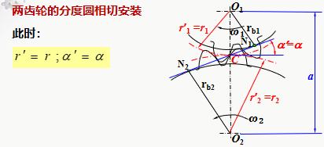

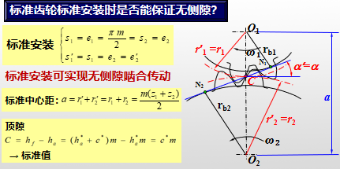

> 连续传动条件

为保证齿轮能连续传动，必须使前一对轮齿尚未脱离啮合时，后一对轮齿进入啮合。

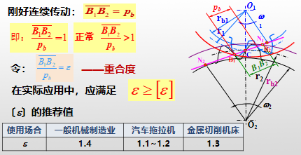

 实质上表明同时参与啮合的轮齿对数的多少

重合度越高，传动平稳性增加，承载能力增加

>渐开线直齿圆柱标准齿轮的传动尺寸

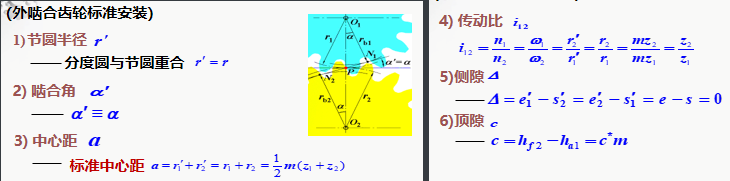

> 小结

### 4-6 渐开线齿轮的切齿原理

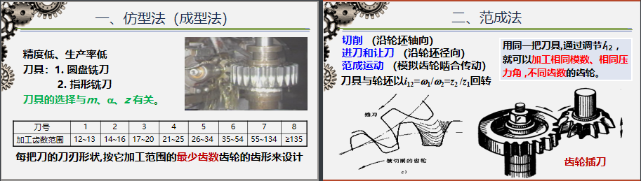

### 4-7 根切现象及变位齿轮

根切现象：用范成法加工齿轮时，将齿根的渐开线齿廓切去一部分的现象

根切的后果：
- 降低轮齿的抗弯强度
- 降低齿轮传动的重合度

产生根切的原因：用范成法切齿时，刀具的齿顶线超过了理论啮合点N1

> 不发生根切的条件

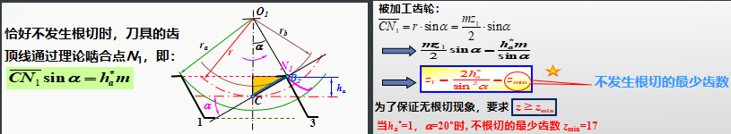

> 避免根切的措施

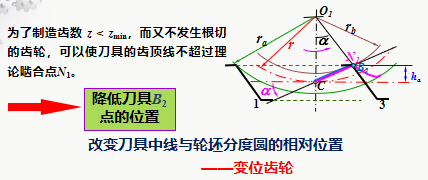

> 变位齿轮

标准齿轮存在的不足之处：
- 一般不能采用齿数 z < zmin 的齿轮； 
- 不适用于中心距 a  a 的场合；
- 一对标准齿轮啮合时，小齿轮的齿根厚度小，啮合次数多，强度低。

变位齿轮的意义：
- 避免根切现象。切削z < zmin的齿轮而不发生根切；
- 配凑中心距。一对齿轮在非标准中 心距的情况下不仅 能安装，而且能 满足侧隙为零、顶隙为标准值的要求；
- 改善小齿轮的强度，提高齿轮的承载能力;
- 修复已磨损的旧齿轮

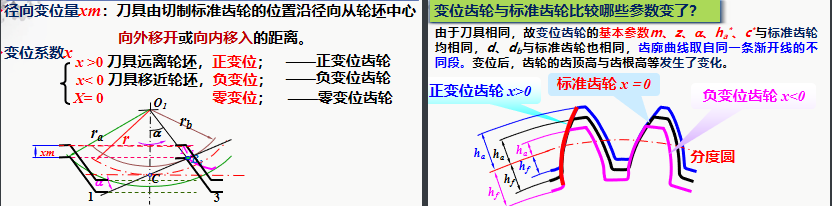

## 5

### 5-1 轮系的类型

轮系：由一系列齿轮组成的传动系统

> 轮系的分类

- 定轴轮系（传动时，各齿轮几何轴线都固定不动的轮系）
  - 平面定轴轮系
  - 空间定轴轮系
- 周转轮系（传动时至少有一个齿轮的几何轴线是运动的）
  - 差动轮系（自由度为2的周转轮系）
  - 行星轮系（自由度为1的周转轮系）

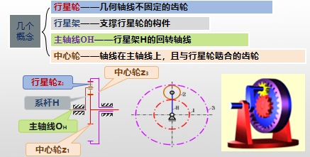

- 复合轮系（由定轴、周转或多个周转轮系组成的轮系）

### 5-2 定轴轮系传动比的计算

轮系的传动比：输入轴与输出轴的角速度或转速之比， 即：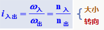

圆锥齿轮传动其输出轴转向的判定：头对头，尾对尾

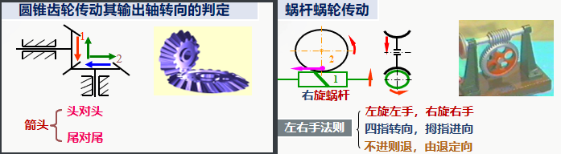

> 定轴轮系传动比大小的计算

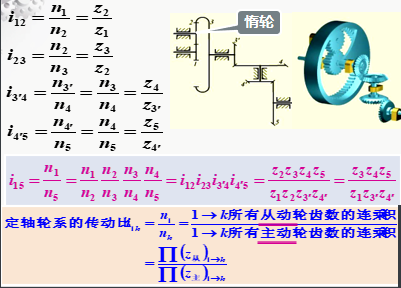

> 首、末两轮转向关系的确定

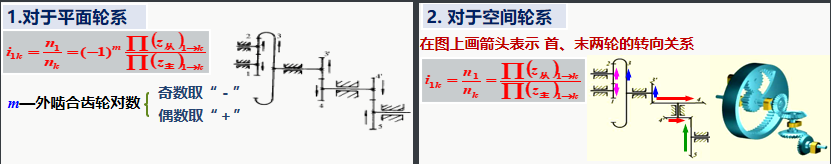

例：

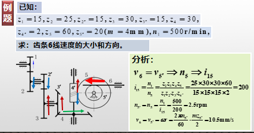

## 6 

### 6-1 连接概述与螺纹的形成、类型

> 连接概述

1. 连接的组成：被连接件、连接件
    被连接件：轴与轴上零件（齿轮、飞轮）、轮类零件的轮圈与轮心、箱体与箱盖、焊接零件中的钢板与型钢等。
    连接件（紧固件）：螺栓、螺母、销、铆钉。

  无专门连接件（紧固件）连接：靠被连接件本身变形组成的过盈配合、利用分子间结合力组成的焊接和粘接等。

2. 连接的作用：

3. 连接的分类：
- 动连接：被连接零件可相对运动—运动副
- 静连接：被连接零件无相对运动—构件
  - 可拆连接：螺纹、键、销、成型连接
  - 不可拆连接：铆接、焊接、粘接
  - 过盈配合：温差法装入—可拆   压如法装入—不可拆

>螺纹的形成

一动点在一圆柱体的表面上，一边绕轴线等速旋转，同时沿轴向作等速移动的轨迹为螺旋线。
平面图形沿螺旋线运动，平面图形始终通过圆柱体轴线。

>螺纹的类型

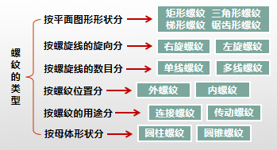

### 6-2 螺纹的主要参数

以三角形螺纹中的普通螺纹为例

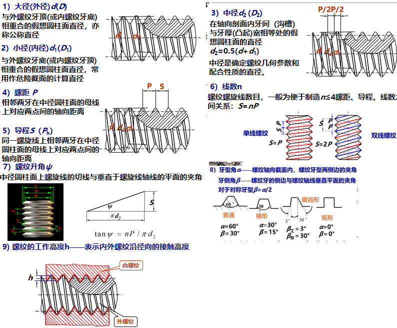

### 6-3 螺旋副的受力分析、自锁和效率

> 受力分析

- （矩形）螺旋副在力矩和轴向载荷下的相对运动
- 作用在中径的水平力推动滑块沿螺纹运动
- 水平力推动滑块沿螺纹中径展开的一斜面上运动

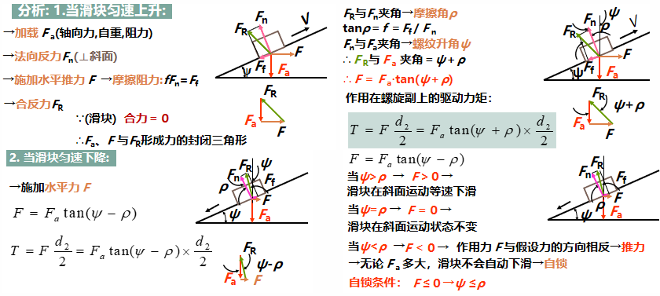

> 自锁

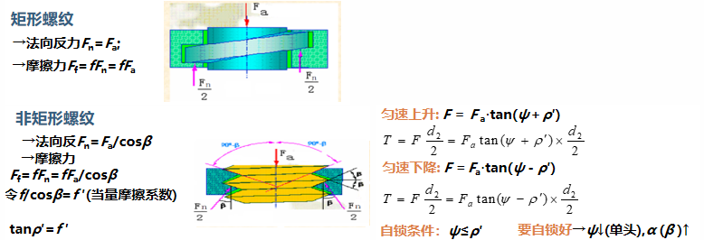

> 效率

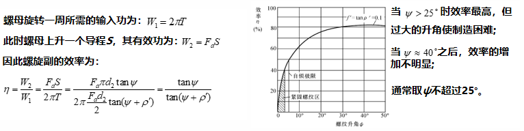

### 6-4 机械制造常用螺纹

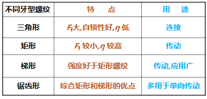

> 三角螺纹

普通螺纹α=60˚的三角形米制螺纹
管螺纹α=55˚或α=60˚

>普通螺纹

以大径d 为公称直径，同一公称直径可以有多种螺距，其中螺距最大的称为粗牙螺纹，其余的统称为细牙螺纹。
粗牙螺纹应用最广。

>细牙螺纹

优点：升角小、小径大、自锁性好、强度高，
缺点：不耐磨易滑扣。
应用：薄壁零件、受动载荷的连接和微调机构。

>管螺纹

- 普通细牙螺纹
- 非螺纹密封管螺纹（圆柱管壁α=55˚）
- 用螺纹密封管螺纹（圆锥管壁α=55˚）
- 60˚圆锥管螺纹

作用：
- 圆柱管螺纹广泛应用于水、煤气、润滑管路系统中
- 圆锥管螺纹不用填料即能保证紧密性而且旋合迅速，适用于密封要求较高的管路连接。

> 梯形螺纹和锯齿形螺纹

常用于传动：
梯形螺纹：α=30º	β=15º
锯齿形螺纹：β=30º	β=3º

- 为了减少摩擦和提高效率，梯形螺纹和锯齿形螺纹的牙型角和牙侧角β 比三角形螺纹的要小得多。
- 用于剖分螺母时，梯形螺纹可消除因摩擦而产生的间隙，应用较广。
- 锯齿形螺纹工作面牙侧角β=3º，效率比梯形螺纹高，但只适合单向传动。

### 6-5 螺纹连接的基本类型及螺纹紧固件

螺栓连接结构特点：被连接件的孔中不切制螺纹，装拆方便

>螺纹连接的基本类型

1. 普通螺栓连接

   优点：

   - 加工简单
   - 对孔的精度和表面粗糙度没有太高要求
   - 钻头粗加工即可，应用最广

2. 铰制孔用螺栓连接（精密螺栓）

   - 承受横向载荷
   - 被连接件的空经粗加工后，需铰刀精加工

3. 双头螺柱连接

   - 由于较厚的被连接件或为了结构紧凑而采用盲孔的连接
   - 允许多次装拆而不损坏被连接件

4. 螺钉连接

   - 螺钉直接旋入被连接件的螺纹孔中，节省螺母
   - 不宜经常拆装，以免被连接件的螺纹被磨损而使连接失效

5. 紧定螺钉连接

   - 拧入后，利用末端叮嘱另一零件的表面或旋入零件相对应的缺口中以固定零件的相对位置
   - 可传递不大的轴向力或扭矩

6. 特殊连接

   - 地脚螺栓连接
   - 吊环螺钉连接

> 螺纹紧固件

1. 螺栓
   - 普通螺栓：六角头，小六角头，标准六角头，大六角头, 内六角
   - 铰制孔螺栓：螺纹部分直径较小
   
2. 双头螺柱（两端带有螺纹）

   - A型：有退刀槽
   - B型：无退刀槽

3. 螺钉（与螺栓区别为要求螺纹部分直径较粗；要求全螺纹）

4. 紧定螺丝

5. 自攻螺丝（由螺钉攻出螺纹）

6. 螺母

   - 六角螺母：标准、薄、厚
   - 薄六角螺母：尺寸受限的地方
   - 厚六角螺母：经常装拆，易于磨损之处
   - 圆螺母：轴上零件的轴向固定（圆螺母+止动垫圈）

7. 垫圈

   - 平垫圈
   - 弹簧垫圈
   - 斜垫圈

   作用：
   - 增加被连接件的支承面积以减小接触处的挤压应力
   - 避免拧紧螺母时擦伤被连接件的表面

### 6-6 螺纹连接的预紧

>螺纹连接装配状态

- 松连接：在装配时不拧紧，只有受外载时才受到力的作用
- 紧连接：在装配时需拧紧，即在承载时，已预先受力，预紧力F0

>预紧目的

增强连接的紧密性、可靠性，防止受载后被连接件之间出现间隙或发生相对滑移。
预紧过紧：拧紧力过大，螺杆静载荷增大、降低螺栓本身强度
预紧过松：拧紧力过小，工作不可靠

>拧紧力矩T

拧紧时：连接件→轴向拉力 ；被连接件→轴向压力
力矩组成部分：
- 螺纹副的摩擦力矩T1；
-  螺母与支承面间的摩擦力矩T2。 

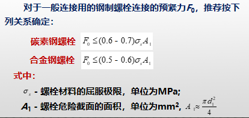

> 预紧力控制方法

- 测量预紧前后螺栓伸长量（精度较高）
- 通过控制拧紧力矩来间接保证预紧力
  - 测力矩扳手：测出预紧力矩
  - 定力矩扳手：达到固定的拧紧力矩T时，弹簧受压将自动打滑

### 6-7 螺纹连接的防松

> 防松的原因

静载荷：ψ<ρ′(自锁) + 预紧后摩擦力→防止松动
冲击、振动和变载荷：预紧力减小、消失→连接松脱
高温：温度变形差异→连接松脱

>防松的原理

消除（或限制）螺纹副之间的相对运动，或增大相对运动的难度。

>防松办法及措施

机械防松和摩擦防松称为可拆卸防松，而永久防松称为不可拆卸防松。
- 摩擦防松（弹簧垫圈、对顶螺母、尼龙圈锁紧螺母、自锁螺母等）
- 机械防松（用机械装置把螺母和螺栓连成一体，消除它们之间相对转动的可能性。）
- 永久防松（端铆、冲点、点焊、粘合 ）

### 6-8 螺栓连接的强度计算

> 松螺栓连接强度计算

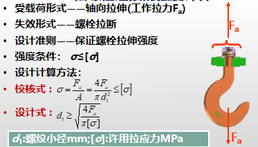

> 紧螺栓连接强度计算

- 仅受预紧力的紧螺栓连接

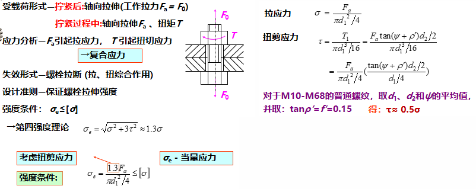

- 受横向载荷的紧螺栓连接

  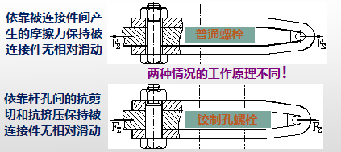

  6-10

- 受轴向载荷的紧螺栓连接