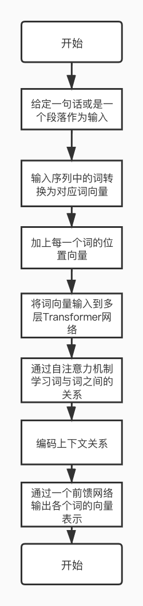

[toc]

# 一、预训练简介

​      预训练通过自监督学习从大规模数据中获得与具体任务无关的预训练模型。体现某一个词在一个特定上下文中的语义表征。第二个步骤是微调，针对具体的任务修正网络。训练数据可以是文本、文本-图像对、文本-视频对。预训练模型的训练方法可使用自监督学习技术（如自回归的语言模型和自编码技术）。可训练单语言、多语言和多模态的模型。此类模型可经过微调之后，用于支持分类、序列标记、结构预测和序列生成等各项技术，并构建文摘、机器翻译、图片检索、视频注释等应用。

## 1.1 历史沿革

- 源于早期的词嵌入（word embedding）的工作，比如 Word2Vec。它的训练的结果是词的嵌入，是一个静态的表示。
- 此后 ULMFiT 是第一个使用 RNN 基于 LM 训练的上下文相关的预训练模型。
- CoVe 利用翻译任务来训练编码器-解码器，并使用编码器作为预训练模型。
- ELMo 使用双向 LSTM 合并两个方向的隐状态获得上下文相关表示。
- GPT 采用 LM 进行训练，它是基于 Transformer 的单向预训练模型。
- BERT 是基于 Transformer 的基于掩码的预训练模型。
- MT-DNN 基于 BERT 增加了一些任务进行多任务训练。
- MASS 使用编码-解码器来训练预训练模型。
- UniLM 尝试同时支持语言理解和生成任务。把预训练模型用于多语言任务。
- XLM 是一种支持多语言的 BERT 模型。
- Unicoder 引入若干新的任务改进了 XLM。
- T5 把多种自然语言任务（比如机器翻译、问答），用了更大的数据，在一个网络训练，同时支持这些任务。
- BART 是一种编码-解码器模型，通过还原损坏的句子训练。
- mBART 将 BART 理念扩展到多语言
- ...

## 1.2 为什么要做预训练模型

- 预训练模型是一种迁移学习的应用，利用几乎无限的文本，学习输入句子的每一个成员的上下文相关的表示，它隐式地学习到了通用的语法语义知识。
- 它可以将从开放领域学到的知识迁移到下游任务，以改善低资源任务，对低资源语言处理也非常有利。
- 预训练模型在几乎所有 NLP 任务中都取得了目前最佳的成果。
- 这个预训练模型+微调机制具备很好的可扩展性，在支持一个新任务时，只需要利用该任务的标注数据进行微调即可，一般工程师就可以实现。

## 1.3 预训练相关的三个技术

> Transformer

- 在NLP各个任务中都取得了优异的性能，是预训练语言模型的核心网络
- 处理流程：

​                                                                                                      


​				在每一层 Transformer 网络中，会将残差连接（residual connection）把自注意力机制前或者前馈神经网络		之前的向量引入进来，以增强自注意力		机制或者前馈网络的输出结果向量。并且还做一个 layer normalization，		也就是通过归一化把同层的各个节点的多维向量映射到一个区间里面，这样各层		节点的向量在一个区间里面。		这两个操作加入在每个子层后，可更加平滑地训练深层次网络。

- self-attention 机制

    ​		假定当前输入包含三个词，给定其输入词向量或是其上一层 Transformer 网络的输出，将其通过三组线性变换，转换得到三组 queries、keys 和 values 向量。Query 和 key 向量用来计算两两词之间的得分，也就是其依赖关系，这个得分会同其对应的 value 向量做加权和，以得到每个词综合上下文信息的表示。给定当前第一个词的 query 向量，其首先同各个词的 key 向量通过点积操作得到这两个词的得分，这些得分用来表示这两个词的依赖或是相关程度。这些得分之后会根据 query 等向量的维度做一定比例的缩放，并将这些得分通过 softmax 操作做归一化。之后，各个得分会同其相对应的 value 向量相乘得到针对第一个词加权的各个 value 向量，这些加权的 value 向量最终相加以得到当前第一个词的上下文表示。

  ​		多头注意力机制就是对一个节点，可以设置几组 K、Q 和 V，分别计算关联度（通过 Q 和 K 计算点积）和加权调整的值（通过 V 和关联度计算）。几组结果可以拼在一起，通过一个线性变换，体现多角度的特征抽取。多头可以是16个头、12个头等。

> 自监督学习

 				在预训练的模型中，AR（自回归）LM 和 AE（自动编码器）是最常用的自监督学习方法，其中，自回归 LM 旨在利用前面的词序列预测下个词的出现		概率（语言模型）。自动编码器旨在对损坏的输入句子，比如遮掩了句子某个词、或者打乱了词序等，重建原始数据。通过这些自监督学习手段来学习单词的		上下文相关表示。

> 微调

 				在做具体任务时，微调旨在利用其标注样本对预训练网络的参数进行调整。以我们使用基于 BERT（一种流行的预训练模型）为例来判断两个句子是否		语义相同。输入是两个句子，经过 BERT 得到每个句子的对应编码表示，我们可以简单地用预训练模型的第一个隐节点预测分类标记判断两个句子是同义句		子的概率，同时需要额外加一个线性层和 softmax 计算得到分类标签的分布。预测损失可以反传给 BERT 再对网络进行微调。当然也可以针对具体任务设计		一个新网络，把预训练的结果作为其输入。

## 1.4 发展趋势

1. 模型越来越大（Transformer的层数变化，一般模型越大能力越强，但训练代价很大）
2. 预训练方法在不断增加（自回归LM，自动编码、多任务训练）
3. 从语言、多语言到多模态不断演进
4. 模型压缩，使之能在实际应用中经济地使用（如手机端的teacher-student models，让小模型接近大模型的能力，但是模型的参数减少很多）

## 1.5 预训练模型举例

> BERT

基于 Transformer，其基本模型为 12 层模型，还有一个大型模型为 24 层模型。


1. tokenizer，简单地理解为词的切分，比如工具 BPE。针对一个数据集合，BPE 工具自动获得该数据集的 token 的集合，取频率最高的前 N 个 token 作为词表，其他的 token 都看作是 UNK（unknown word）。
2. 对数据集合的每个数据，通过 BPE 做 tokenize，形成 token 的序列。
3. 训练时，每个 token 有一个多维向量表示，比如1024维，随机初始化。
4.  计算预测的损失。该损失反向传播来调整各层的网络参数，也包括每个 token 的多维向量表示。
5. 最后训练的结果，包括每个 token 的多维向量表示、每层的网络参数，以及各个 attention model 的参数等。
6. 在用预训练模型时，把输入序列 tokenize 之后，对每个 token，从词典中得到多维向量表示。然后根据每层的网络参数，计算输出。

训练任务：BERT 使用了掩码语言模型（就是盖住一个单词或者多个单词，然后让模型预测），损失用来调整网络。

BERT 还使用 NSP（下一句预测），旨在预测第二句是否是第一句的下一句。

> UniLM

UniLM 由微软亚洲研究院自然语言计算组开发，是一种最先进的预训练的模型，用于语言理解和生成任务,是一个 Transformer 机制。

三个任务训练：

- 掩码语言模型（就是自编码）类似于 BERT，利用左右词汇预测被盖住的词。
- 自回归语言模型，类似 GPT，利用前面的词序列预测下一个词。
- 编码-解码模型，利用输入句子和已经输出的词来预测接下来的词。

这三个任务进行多任务训练，通过一个掩码矩阵控制哪些词可以用来 attention。训练得到的模型具备了理解和生成两种能力。在 GLUE 任务集合、文摘生成和答案抽取等任务上都取得了当时最好的水平。

# 二、手写数字识别模型

### 2.1 准备数据集、定义超参数等准备工作

> 首先是导入需要使用的包：

```python
import tensorflow as tf
from tensorflow.examples.tutorials.mnist import input_data
import os
```

> 定义超参数

假设我们已经获得了最优的超参数，设置学利率为0.001，dropout的保留节点比例为0.9，最大循环次数为1000。

另外，还要设置两个路径，第一个是数据下载下来存放的地方，一个是summary输出保存的地方。

```python
max_steps = 1000  # 最大迭代次数
learning_rate = 0.001   # 学习率
dropout = 0.9   # dropout时随机保留神经元的比例
data_dir = './MNIST_DATA'   # 样本数据存储的路径
log_dir = './MNIST_LOG'    # 输出日志保存的路径
```

> GPU设置

这里使用GPU进行训练，如果使用cpu，可以略过此步。如果使用GPU建议进行设置

```python
os.environ["CUDA_VISIBLE_DEVICES"] = "0"
config = tf.ConfigProto(allow_soft_placement = True)
gpu_options = tf.GPUOptions(per_process_gpu_memory_fraction = 0.33)
config.gpu_options.allow_growth = True
```

上述代码的意思是使用GPU设备0，最多给GPU分配总共内存的百分之33，并且允许GPU按需申请内存。也就是说，假设一个程序使用一块GPU内存百分之10就够了，如果未指定allow_growth=True，那么程序会直接占用GPU内存的百分之33，因为这个是我们给它分配的。如果我们连0.33，也就是GPU内存的百分之33都没有指定，那么程序会直接占用整个GPU设备0。

> 下载数据下载数据是直接调用了[tensorflow](https://cuijiahua.com/blog/tag/tensorflow/)提供的函数read_data_sets，输入两个参数，第一个是下载到数据存储的路径，第二个one_hot表示是否要将类别标签进行独热编码。它首先回去找制定目录下有没有这个数据文件，没有的话才去下载，有的话就直接读取。所以第一次执行这个命令，速度会比较慢，因为没有数据集，需要进行下载。

```python
# 获取数据集，并采用采用one_hot编码
mnist = input_data.read_data_sets(data_dir,one_hot = True)
```

### 2.2 数据处理

> 创建tensorflow默认会话：

```python
sess = tf.InteractiveSession(config = config)
```

为了使设置的GPU参数生效，我们需要在创建会话的时候传入这个config参数。

> 创建输入数据的占位符，分别创建特征数据x，标签数据y_

在tf.placeholder()函数中传入了3个参数，第一个是定义数据类型为float32；第二个是数据的大小，特征数据是大小784的向量，标签数据是大小为10的向量，None表示不定死大小，到时候可以传入任何数量的样本；第3个参数是这个占位符的名称。

```python
with tf.name_scope('input'):
    x = tf.placeholder(tf.float32, [None, 784], name='x-input')
    y_ = tf.placeholder(tf.float32, [None, 10], name='y-input')
```

mnist下载好的数据集就是很多个1*784的向量，就是已经对28*28的图片进行了向量化处理。

> 使用tf.summary.image保存图像信息

特征数据其实就是图像的像素数据拉升成一个1*784的向量，现在如果想在tensorboard上还原出输入的特征数据对应的图片，就需要将拉升的向量转变成28 * 28 * 1的原始像素了，于是可以用tf.reshape()直接重新调整特征数据的维度：

将输入的数据转换成[28 * 28 * 1]的shape，存储成另一个tensor，命名为image_shaped_input。
为了能使图片在tensorbord上展示出来，使用tf.summary.image将图片数据汇总给tensorbord。
tf.summary.image（）中传入的第一个参数是命名，第二个是图片数据，第三个是最多展示的张数，此处为10张。

```python
# 保存图像信息
with tf.name_scope('input_reshape'):
    image_shaped_input = tf.reshape(x, [-1, 28, 28, 1])
    tf.summary.image('input', image_shaped_input, 10)
```

### 2.3 初始化参数并保存参数信息到summary

> 初始化参数w和b

在构建神经网络模型中，每一层中都需要去初始化参数w,b,为了使代码简介美观，最好将初始化参数的过程封装成方法function。 创建初始化权重w的方法，生成大小等于传入的shape参数，标准差为0.1，遵循正态分布的随机数，并且将它转换成tensorflow中的variable返回。

```python
# 初始化权重参数
def weight_variable(shape):
    initial = tf.truncated_normal(shape, stddev = 0.1)
    return tf.Variable(initial)
```

创建初始换偏执项b的方法，生成大小为传入参数shape的常数0.1，并将其转换成tensorflow的variable并返回。

```python
# 初始化偏执参数
def bias_variable(shape):
    initial = tf.constant(0.1, shape = shape)
    return tf.Variable(initial)
```

> 记录训练过程参数变化

我们知道，在训练的过程在参数是不断地在改变和优化的，我们往往想知道每次迭代后参数都做了哪些变化，可以将参数的信息展现在tenorbord上，因此我们专门写一个方法来收录每次的参数信息。

```python
# 绘制参数变化
def variable_summaries(var):
    with tf.name_scope('summaries'):
        # 计算参数的均值，并使用tf.summary.scaler记录
        mean = tf.reduce_mean(var)
        tf.summary.scalar('mean', mean)

        # 计算参数的标准差
        with tf.name_scope('stddev'):
            stddev = tf.sqrt(tf.reduce_mean(tf.square(var - mean)))
        # 使用tf.summary.scaler记录记录下标准差，最大值，最小值
        tf.summary.scalar('stddev', stddev)
        tf.summary.scalar('max', tf.reduce_max(var))
        tf.summary.scalar('min', tf.reduce_min(var))
        # 用直方图记录参数的分布
        tf.summary.histogram('histogram', var)
```

### 2.4 构建神经网络层

> 创建第一层隐藏层

创建一个构建隐藏层的方法,输入的参数有：

- input_tensor：特征数据
- input_dim：输入数据的维度大小
- output_dim：输出数据的维度大小(=隐层神经元个数）
- layer_name：命名空间
- act=tf.nn.relu：激活函数（默认是relu)

```python
# 构建神经网络
def nn_layer(input_tensor, input_dim, output_dim, layer_name, act=tf.nn.relu):
    # 设置命名空间
    with tf.name_scope(layer_name):
        # 调用之前的方法初始化权重w，并且调用参数信息的记录方法，记录w的信息
        with tf.name_scope('weights'):
            weights = weight_variable([input_dim, output_dim])
            variable_summaries(weights)
        # 调用之前的方法初始化权重b，并且调用参数信息的记录方法，记录b的信息
        with tf.name_scope('biases'):
            biases = bias_variable([output_dim])
            variable_summaries(biases)
        # 执行wx+b的线性计算，并且用直方图记录下来
        with tf.name_scope('linear_compute'):
            preactivate = tf.matmul(input_tensor, weights) + biases
            tf.summary.histogram('linear', preactivate)
        # 将线性输出经过激励函数，并将输出也用直方图记录下来
        activations = act(preactivate, name='activation')
        tf.summary.histogram('activations', activations)
    # 返回激励层的最终输出
    return activations
```

> 创建一个dropout层

随机关闭掉hidden1的一些神经元，并记录keep_prob，减少保存参数，防止过拟合。

```python
# 创建dropout层
with tf.name_scope('dropout'):
    keep_prob = tf.placeholder(tf.float32)
    tf.summary.scalar('dropout_keep_probability', keep_prob)
    dropped = tf.nn.dropout(hidden1, keep_prob)
```

> 创建一个输出层

输入的维度是上一层的输出:500,输出的维度是分类的类别种类：10，激活函数设置为全等映射identity。（暂且先别使用softmax，会放在之后的损失函数中一起计算）

### 2.5 创造损失函数

使用tf.nn.softmax_cross_entropy_with_logits来计算softmax并计算交叉熵损失,并且求均值作为最终的损失值。

```python
# 创建损失函数
with tf.name_scope('loss'):
    # 计算交叉熵损失（每个样本都会有一个损失）
    diff = tf.nn.softmax_cross_entropy_with_logits(labels=y_, logits=y)
    with tf.name_scope('total'):
        # 计算所有样本交叉熵损失的均值
        cross_entropy = tf.reduce_mean(diff)
    tf.summary.scalar('loss', cross_entropy)
```

### 2.6 训练

> 使用AdamOptimizer优化器训练模型，最小化交叉熵损失。

```python
# 使用AdamOptimizer优化器训练模型，最小化交叉熵损失
with tf.name_scope('train'):
    train_step = tf.train.AdamOptimizer(learning_rate).minimize(cross_entropy)
```

> 计算准确率,并用tf.summary.scalar记录准确率。

```python
# 计算准确率
with tf.name_scope('accuracy'):
    with tf.name_scope('correct_prediction'):
        # 分别将预测和真实的标签中取出最大值的索引，弱相同则返回1(true),不同则返回0(false)
        correct_prediction = tf.equal(tf.argmax(y, 1), tf.argmax(y_, 1))
    with tf.name_scope('accuracy'):
        # 求均值即为准确率
        accuracy = tf.reduce_mean(tf.cast(correct_prediction, tf.float32))
```

### 2.7 所有变量初始化

将所有的summaries合并，并且将它们写到之前定义的log_dir路径。

```python
# summaries合并
merged = tf.summary.merge_all()
# 写到指定的磁盘路径中
train_writer = tf.summary.FileWriter(log_dir + '/train', sess.graph)
test_writer = tf.summary.FileWriter(log_dir + '/test')

# 运行初始化所有变量
tf.global_variables_initializer().run()
```

### 2.8 送入数据集

feed_dict用于获取数据，如果是train==true，也就是进行训练的时候，就从mnist.train中获取一个batch大小为100样本，并且设置dropout值为0.9。如果是不是train==false,则获取minist.test的测试数据，并且设置dropout为1，即保留所有神经元开启。

同时，每隔10步，进行一次测试，并打印一次测试数据集的准确率，然后将测试数据集的各种summary信息写进日志中。 其余的时候，都是在进行训练，将训练集的summary信息并写到日志中。

```python
# summaries合并
merged = tf.summary.merge_all()
# 写到指定的磁盘路径中
train_writer = tf.summary.FileWriter(log_dir + '/train', sess.graph)
test_writer = tf.summary.FileWriter(log_dir + '/test')

# 运行初始化所有变量
tf.global_variables_initializer().run()

def feed_dict(train):
    if train:
        xs, ys = mnist.train.next_batch(100)
        k = dropout
    else:
        xs, ys = mnist.test.images, mnist.test.labels
        k = 1.0
    return {x: xs, y_: ys, keep_prob: k}

for i in range(max_steps):
    if i % 10 == 0:  # 记录测试集的summary与accuracy
        summary, acc = sess.run([merged, accuracy], feed_dict=feed_dict(False))
        test_writer.add_summary(summary, i)
        print('Accuracy at step %s: %s' % (i, acc))
    else:  # 记录训练集的summary
        summary, _ = sess.run([merged, train_step], feed_dict=feed_dict(True))
        train_writer.add_summary(summary, i)

train_writer.close()
test_writer.close()
```

### 2.9 运行程序

运行整个程序，在程序中定义的summary node就会将要记录的信息全部保存在指定的logdir路径中了，训练的记录会存一份文件，测试的记录会存一份文件。