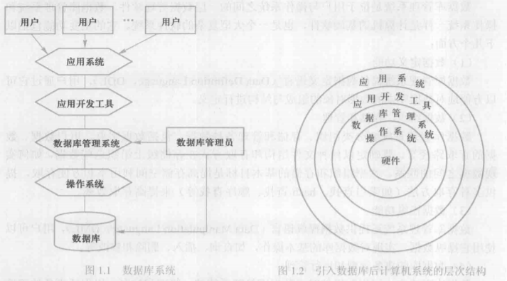
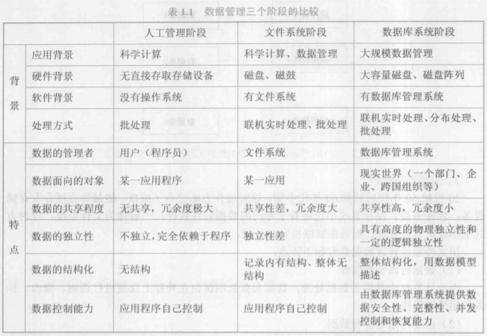
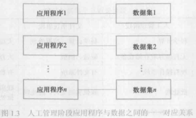
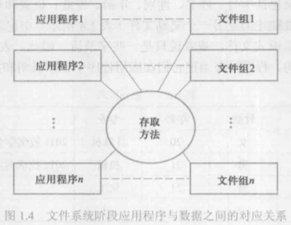
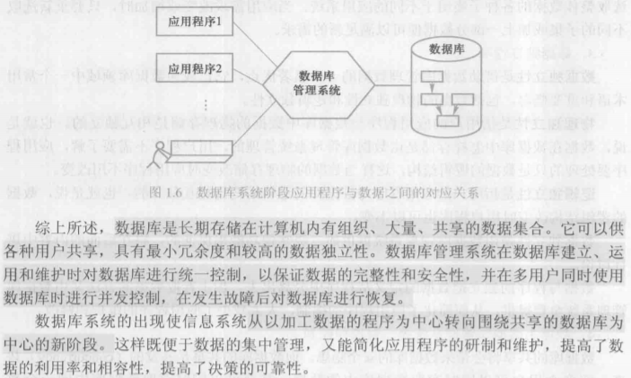

[toc]

## 第 1 章	绪论

### 1.1 数据库系统概述

#### 1.1.1 数据库的4个基本概念
数据，数据库，数据库管理系统和数据库系统是与数据库技术密切相关的四个概念：

> 数据（data）

定义：描述事物的符号记录称为数据
数据是数据库中存储的基本对象
数据的含义称为数据的语义，数据与其语义是不可分的

> 数据库（DataBase，DB）

数据库是长期存储在计算机内，有组织的，可共享的大量数据的集合。
数据库中的数据按一定的数据模型组织，描述和储存，具有较小的冗余度（redundancy），较高的数据独立性（data independence）和易扩展性（scalability），并可为各种用户共享。
数据库的三个基本特点：永久存储，有组织和可共享。

> 数据库管理系统（DataBase Management System，DBMS）

任务：科学地组织和存储数据，高效地获取和维护数据
数据库管理系统是位于用户与操作系统之间的一层数据管理软件
数据库管理系统和操作系统一样是计算机的基础软件，也是一个大型复杂的软件系统。
主要功能：
（1）数据定义功能：
数据库管理系统数据定义语言（Data Definition Language，DDL）用户通过其对数据库中的数据对象的组成与结构进行定义。
（2）数据组织，存储和管理
数据组织和存储的基本目标是提高存储空间和利用率和方便存取。
（3）数据操纵功能
数据库管理系统数据操纵语言（Data Manipulation Language，DML）用户通过其操纵数据，实现对数据库的基本操作，如查询，插入，删除，修改等。
（4）数据库的事务管理和运行管理
（5）数据库的建立和维护功能
（6）其他功能

> 数据库系统（DataBase System，DBS）

数据库系统是由数据库，数据库管理系统（及其应用开发工具），应用程序和数据库管理员（DataBase Administer，DBA）组成的存储，管理，处理和维护数据的系统。
在一般不引起混淆的情况下，把数据库系统简称为数据库。

#### 1.1.2 数据管理技术的产生和发展

> 人工管理阶段

特点：
（1）数据不保存
（2）应用程序管理数据
（3）数据不共享
（4）数据不具有独立性
在人工管理阶段，应用程序与数据之间一 一对应。

> 文件系统阶段

特点：
（1）数据可以长期保存
（2）由文件系统管理数据
缺点：
（1）数据共享性差，冗余度大
（2）数据独立性差

> 数据库系统阶段

从文件系统到数据库系统标志着数据管理技术的的飞跃。

#### 1.1.3 数据库系统的特点

使用文件系统提供的fopen，fread，fwrite，fseek，fclose等操作来编程，工作量大，编程复杂，且开发速度慢，而数据库提供了功能强大的操作，开发效率大大提高。
与人工管理和文件系统相比，数据库系统的特点主要有以下几个方面：

> 数据结构化

数据库系统实现整体数据的结构化，这是数据库的主要特征之一，也是数据库系统与文件系统的本质区别。
“整体”结构化是指数据库中的数据不再仅仅针对某一个应用，而是面向整个组织或企业，不仅数据内部是结构化的，而且整体是结构化的，数据之间是具有联系的。

> 数据的共享性高，冗余度低且易扩充

数据共享可以大大减少数据冗余，节约存储空间。数据共享还能够避免数据之间的不相容性与不一致性。
数据面向整个系统，是由结构的数据，不仅可以被多个应用共享使用，而且容易增加新的应用，这就使得数据库系统弹性大，易于扩充，而且适用各种用户的要求。

> 数据独立性高

数据独立性是借助数据库管理数据的显著优点，包括数据的物理独立性和逻辑独立性：
物理独立性：用户的应用程序与数据库中数据的物理存储是相互独立的。
逻辑独立性：用户的应用程序与数据库的逻辑结构是相互独立的。

> 数据由数据库管理系统统一管理和控制

数据库管理系统还需要提供的数据控制功能：
（1）数据的安全性保护：数据的安全性是指保护数据以防止不合法使用造成的数据泄密和破坏。
（2）数据的完整性检查：数据的完整性是指数据的正确性，有效性和相容性。
（3）并发控制
（4）数据库恢复：数据库管理系统必须具有将数据库从错误状态恢复到某一已知的正确状态（亦称完整状态或一致状态）的功能，这就是数据库的恢复功能。

### 1.2 数据模型

数据模型也是一种模型，它是对现实世界数据特征的抽象，也就是说数据模型是用来描述数据，组织数据和对数据进行操作的。
数据模型是数据库系统的核心和基础。
#### 1.2.1 两类数据模型
根据模型应用的不同目的，可以将这些模型划分为两大类，它们分别属于两个不同的层次。第一类是概念模型，第二类是逻辑模型和物理模型。
为了把现实世界中的具体事物抽象，组织为某一数据库管理系统支持的数据模型，首先将现实世界抽象为信息世界，然后将信息世界转换为机器世界