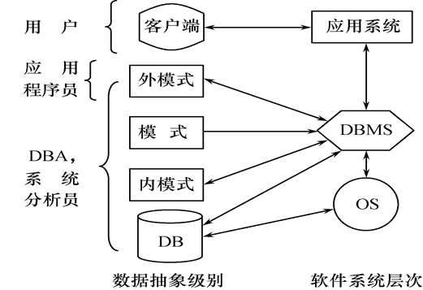

## 第1章 绪论

### 1.1 数据库系统概述

#### 1.1.1四个基本概念

>数据（Data）

数据是数据库中存储的基本对象
数据的定义：描述事物的符号记录
数据的种类：文本、图形、图像、音频、视频等等
数据的特点：数据于其语义是不可分的

>数据库（Database）

数据库是长期储存在计算机内，有组织的，可共享的大量数据的集合
数据库的基本特征：
- 数据按一定的数据模型组织，描述和存储
- 可为各种用户共享
- 冗余度较小
- 数据独立性较高
- 易扩展

>数据库管理系统（DBMS）

什么是DBMS:
- 是位于用户和操作系统之间的一层数据管理软件
- 是基础软件，是一个大型复杂的软件系统

DBMS的用途：科学地组织和存储数据。高效地获取和维护数

DBMS的主要功能：
- 数据定义功能
  - 提供数据定义语言（DDL）
  - 定义数据库中的数据对象
- 数据组织、存储和管理
  - 分类组织、存储和管理各类数据
  - 确定组织数据的文件结构和存取方式
  - 实现数据之间的联系
  - 提供多种存取方法提高存取效率
- 数据操纵功能
  - 提供数据操纵语言（DML）
  - 实现对数据库的基本操作（增加、插入、删除和修改）
- 数据库的事务管理和运行管理
数据库在建立、运行和维护时由DBMS统一管理和控制保证数据的安全性、完整性、多用户对数据的并发使用和发生故障后的系统恢复

- 数据库的建立和维护功能（实用程序）
  - 数据库初始数据装载转换
  - 数据库转储
  - 介质故障恢复
  - 数据库的重组
  - 性能监视分析等
- 其他功能
  - DBMS与网络中其它软件系统的通信
  - 两个DBMS系统的数据转换
  - 异构数据库之间的互访和互操作

>数据库系统（DBS）

在计算机系统中引入数据库后的系统构成数据库系统
数据库系统的构成：
  - 数据库
  - 数据库管理系统（及开发工具）
  - 应用系统
  - 数据库管理员

#### 1.1.2 数据库管理技术的产生和发展

>什么是数据管理

- 对数据进行分类、组织、编码、存储、检索和维护
- 数据处理（对各种数据进行收集、存储、加工和传播的一系列活动的总和）的中心问题

>数据管理技术的发展过程

- 人工管理阶段
- 文件系统阶段
- 数据库系统阶段

>数据管理技术发展的动力

- 应用需求的推动
- 计算机硬件的发展
- 计算机软件的发展

#### 1.1.3 数据库系统的特点

>结构化

整体数据的结构化是数据库的主要特征之一

整体结构化
  - 不再仅仅针对某一个应用，而是面向全组织
  - 不仅数据内部结构化，整体是结构化的，数据之间具有联系

数据库中实现的是数据真正的结构化
  - 数据的结构用数据模型描述，无需程序定义和解释
  - 数据可以变长
  - 数据的最小存取单位是数据项

>数据的共享性高、冗余度低、易扩展

数据库系统从整个角度看待和描述数据，数据面向整个系统，可以被多个用户、多个应用共享使用
数据共享的好处：
- 减小数据冗余，节约存储空间
- 避免数据之间的不相容性与不一致性
- 使系统易于扩展

>独立性高

- 物理独立性：指用户的应用程序与存储在磁盘上的数据库中的数据是相互独立的。当数据的物理存储改变了，应用程序不用改变。
- 逻辑独立性：指用户的应用程序与数据库的逻辑结构是相互独立的。数据的逻辑结构改变了，用户程序也可以不变。

数据独立性是由DBMS的二级映像功能来保证的

>DBMS统一管理和控制

DBMS提供的数据控制功能
- 数据的安全性保护：保护数据，以防止不合法的使用造成的数据的泄密和破坏
- 数据的完整性检查：将数据控制在有效范围内，或保证数据之间满足一定的关系
- 并发控制：对多用户的并发控制加以控制和协调，防止相互干扰而得到错误的结果
- 数据库恢复：将数据库从错误状态恢复到某一已知的正确状态

### 1.2 数据模型

在数据领域中用数据模型这个工具来抽象、表示和处理现实世界中的数据和信息
通俗地讲数据模型就是现实世界的模拟
数据模型就是数据库系统的核心和系统
数据模型应满足三方面要求：
- 能比较真实地模拟真实世界
- 容易为人所理解
- 便于在计算机上实现

#### 1.2.1  两大类数据模型

- 概念模型
也称信息模型，它是按用户的观点来对数据和信息建模，用于数据库设计
- 逻辑模型和物理模型
逻辑模型主要博爱阔网络模型、层次模型、关系模型、面向对象模型等。按计算机系统的观点对数据进行建模，用于DBMS的实现
物理模型是对数据最底层的抽象，描述数据在系统内部的表示方式和存取方法，在磁盘或磁带上的存储方式和存取方法

客观对象的抽象过程：两步抽象
1. 现实世界中的客观对象抽象为概念模型
2. 把概念模型转换为某一DBMS支持的数据模型

现实世界-->概念模型-->逻辑模型-->物理模型
   （数据库设计人员完成）（由DBMS完成）

#### 1.2.2 概念模型

>概念模型的用途

- 概念模型用于信息世界的建模
- 是现实世界到机器世界的一个中间层次
- 是数据库设计的有力工具
- 数据库设计人员和用户之间进行交流的工具

>对概念模型的基本要求

- 较强的语义表达能力
- 能够方便、直接地表达应用中的各种语义知识
- 简单、清晰、易于用户理解

> 信息世界中的基本概念

1. 实体：客观存在并可相互区别的事物称为实体。可以是具体的人、事、物或抽象的概念
2. 属性：实体所具有的某一特性称为属性。一个实体可以由若干个属性来刻画
3. 码：唯一标识实体的属性集称为码
4. 域：属性的取值范围称为该属性的域
5. 实体型：用实体名及其属性名集合来抽象和刻画同类实体称为实体型
6. 实体集：同一类型实体的集合称为实体集
7. 联系：现实世界中事物内部以及事物之间的联系在信息世界中反映为实体内部的联系和实体之间的联系
  - 实体内部的联系通常是指组成实体的各属性之间的联系
  - 实体之间的联系通常是指不同实体集之间的联系

>单个实体型内的联系

如职工类型中的领导与被领导关系为一对多

>概念模型的一种表示方法

实体—联系方法（E-R方法）
用E-R图来描述现实世界的概念模型
E-R方法也称为E-R模型
- 实体型：用矩形表示，矩形框内写明实体名
- 属性：用椭圆形表示，并用无向边将其与相应的实体连接起来
- 联系
  - 联系本身：用菱形表示，菱形框内写明联系名，并用无向边分别与有关实体连接起来，同时在无向边旁标上联系的类型（1:1、1:n或m:n）
  - 联系的属性：联系本身也是一种实体型，也可以有属性。如果一个联系具有属性，则这些属性也要用无向边与该联系连接起来

#### 1.2.3 数据模型的组成要素

- 数据结构
- 数据操作
- 完整性约束条件

> 数据结构

描述数据库的组成对象，以及对象之间的联系

描述的内容：
- 与数据类型、内容、性质有关的对象
- 与数据之间联系有关的对象

数据结构是对系统静态特性的描述

>数据操作

数据库中各种对象(型)的实例(值)允许执行的操作及有关的操作规则

数据操作的类型：
- 查询
- 更新(包括插入、删除、修改)

数据模型对操作的定义：
- 操作的确切含义
- 操作符号
- 操作规则（如优先级）
- 实现操作的语言

数据操作是对系统动态特性的描述

>数据的完整性约束条件

- 一组完整性规则的集合。
- 完整性规则：给定的数据模型中数据及其联系所具有的制约和储存规则
- 用以限定符合数据模型的数据库状态以及状态的变化，以保证数据的正确、有效、相容

数据模型对完整性约束条件的定义
- 反映和规定本数据模型必须遵守的基本的通用的完整性约束条件。例如在关系模型中，任何关系必须满足实体完整性和参照完整性两个条件。
- 提供定义完整性约束条件的机制，以反映具体应用所涉及的数据必须遵守的特定的语义约束条件。

#### 1.2.4 最常用的数据模型

- 非关系模型
  - 层次模型
  - 网状模型
- 关系模型
- 面向对象模型
- 对象关系模型

#### 1.2.5 层次模型

层次模型是数据库系统中最早出现的数据模型 
层次数据库系统的典型代表是IBM公司的IMS（Information Management System）数据库管理系统
层次模型用树形结构来表示各类实体以及实体间的联系  

满足下面两个条件的基本层次联系的集合为层次模型
1. 有且只有一个结点没有双亲结点，这个结点称为根结点
2. 根以外的其它结点有且只有一个双亲结点

>层次模型的特点

- 结点的双亲是唯一的
- 只能直接处理一对多的实体联系
- 每个记录类型可以定义一个排序字段，也称为码字段
- 任何记录值只有按其路径查看时，才能显出它的全部意义
- 没有一个子女记录值能够脱离双亲记录值而独立存在

>多对多联系在层次模型中的表示

用层次模型间接表示多对多联系
方法：将多对多联系分解成一对多联系
分解方法：
- 冗余结点法
- 虚拟结点法

>层次模型的数据操纵

查询、插入、删除、更新 

>层次模型的完整性约束条件

- 无相应的双亲结点值就不能插入子女结点值
- 如果删除双亲结点值，则相应的子女结点值也被同时删除
- 更新操作时，应更新所有相应记录，以保证数据的一致性

>层次模型的优点

- 层次模型的数据结构比较简单清晰 
- 查询效率高，性能优于关系模型，不低于网状模型
- 层次数据模型提供了良好的完整性支持
>层次模型的缺点

- 多对多联系表示不自然
- 对插入和删除操作的限制多，应用程序的编写比较复杂 
- 查询子女结点必须通过双亲结点
- 由于结构严密，层次命令趋于程序化 

>层次数据模型的存储结构

- 邻接法：按照层次树前序遍历的顺序把所有记录值依次邻接存放，即通过物理空间的位置相邻来实现层次顺序
- 链接法：用指引来反映数据之间的层次联系
  - 子女－兄弟链接法（每个记录设两类指针，分别指向最左边的子女（每个记录型对应一个）和最近的兄弟）
  - 层次序列链接法（按树的前序穿越顺序链接各记录值）

#### 1.2.6 网状模型

网状数据库系统采用网状模型作为数据的组织方式 

>满足下面两个条件的基本层次联系的集合
1. 允许一个以上的结点无双亲
2. 一个结点可以有多于一个的双亲

>表示方法(与层次数据模型相同)
实体型：用记录类型描述，每个结点表示一个记录类型（实体）
属性：用字段描述，每个记录类型可包含若干个字段
联系：用结点之间的连线表示记录类型（实体）之间的一对多的父子联系

>网状模型与层次模型的区别

- 网状模型允许多个结点没有双亲结点
- 网状模型允许结点有多个双亲结点
- 网状模型允许两个结点之间有多种联系（复合联系）
- 网状模型可以更直接地去描述现实世界
- 层次模型实际上是网状模型的一个特例

网状模型中子女结点与双亲结点的联系可以不唯一

>多对多联系在网状模型中的表示

用网状模型间接表示多对多联系
方法：将多对多联系直接分解成一对多联系

网状数据库系统（如DBTG）对数据操纵加了一些限制，提供了一定的完整性约束

- 码：唯一标识记录的数据项的集合 
- 一个联系中双亲记录与子女记录之间是一对多联系
- 支持双亲记录和子女记录之间某些约束条件 

>网状数据模型的存储结构

关键:实现记录之间的联系
常用方法:
- 单向链接
- 双向链接
- 环状链接
- 向首链接

>网状数据模型的优点

- 能够更为直接地描述现实世界，如一个结点可以有多个双亲
- 具有良好的性能，存取效率较高

>网状数据模型的缺点

- 结构比较复杂，而且随着应用环境的扩大，数据库的结构就变得越来越复杂，不利于最终用户掌握
- DDL、DML语言复杂，用户不容易使用

#### 1.2.7 关系模型

关系数据库系统采用关系模型作为数据的组织方式 

>关系数据模型的数据结构

- 关系（Relation）：一个关系对应通常说的一张表
- 元组（Tuple）：表中的一行即为一个元组
- 属性（Attribute）：表中的一列即为一个属性，给每一个属性起一个名称即属性名
- 主码（Key）：表中的某个属性组，它可以唯一确定一个元组。
- 域（Domain）：属性的取值范围。
- 分量：元组中的一个属性值。
- 关系模式：对关系的描述
关系名（属性1，属性2，…，属性n）
学生（学号，姓名，年龄，性别，系，年级）

关系必须是规范化的，满足一定的规范条件
最基本的规范条件：关系的每一个分量必须是一个不可分的数据项, 不允许表中还有表 

>关系数据模型的操纵与完整性约束

数据操作：查询、插入、删除、更新
数据操作是集合操作，操作对象和操作结果都是关系，即若干元组的集合
存取路径对用户隐蔽，用户只要指出“干什么”，不必详细说明“怎么干”

关系的完整性约束条件 :

- 实体完整性
- 参照完整性
- 用户定义的完整性

>关系数据模型的存储结构

实体及实体间的联系都用表来表示
表以文件形式存储
- 有的DBMS一个表对应一个操作系统文件
- 有的DBMS自己设计文件结构

>关系数据模型的优点

- 建立在严格的数学概念的基础上
- 概念单一
  - 实体和各类联系都用关系来表示
  - 对数据的检索结果也是关系
- 关系模型的存取路径对用户透明
  - 具有更高的数据独立性，更好的安全保密性
  - 简化了程序员的工作和数据库开发建立的工作

>关系数据模型的缺点

- 存取路径对用户透明导致查询效率往往不如非关系数据模型
- 为提高性能，必须对用户的查询请求进行优化增加了开发DBMS的难度

### 1.3 数据库系统结构

- 从数据库管理系统角度看，数据库系统通常采用三级模式结构，是数据库系统内部的系统结构 
- 从数据库最终用户角度看（数据库系统外部的体系结构） ，数据库系统的结构分为:
  - 单用户结构
  - 主从式结构
  - 分布式结构
  - 客户／服务器
  - 浏览器／应用服务器／数据库服务器多层结构等

#### 1.3.1 数据库系统模式的概念

>“型” 和“值” 的概念

型(Type)：对某一类数据的结构和属性的说明
值(Value)：是型的一个具体赋值

>模式和实例

模式（Schema）

- 数据库逻辑结构和特征的描述
- 是型的描述
- 反映的是数据的结构及其联系
- 模式是相对稳定的

实例（Instance）

- 模式的一个具体值
- 反映数据库某一时刻的状态
- 同一个模式可以有很多实例
- 实例随数据库中的数据的更新而变动

#### 1.3.2 数据库系统的三级模式结构

- 模式
- 外模式
- 内模式

>模式

模式（也称逻辑模式）

- 数据库中全体数据的逻辑结构和特征的描述
- 所有用户的公共数据视图，综合了所有用户的需求

一个数据库只有一个模式

模式的地位：是数据库系统模式结构的中间层

- 与数据的物理存储细节和硬件环境无关
- 与具体的应用程序、开发工具及高级程序设计语言无关

模式的定义

- 数据的逻辑结构（数据项的名字、类型、取值范围等）
- 数据之间的联系
- 数据有关的安全性、完整性要求

>外模式（也称子模式或用户模式）

- 数据库用户（包括应用程序员和最终用户）使用的局部数据的逻辑结构和特征的描述
- 数据库用户的数据视图，是与某一应用有关的数据的逻辑表示

外模式的地位：介于模式与应用之间

- 模式与外模式的关系：一对多
  - 外模式通常是模式的子集
  - 一个数据库可以有多个外模式。反映了不同的用户的应用需求、看待数据的方式、对数据保密的要求
  - 对模式中同一数据，在外模式中的结构、类型、长度、保密级别等都可以不同
- 外模式与应用的关系：一对多
  - 同一外模式也可以为某一用户的多个应用系统所使用
  - 但一个应用程序只能使用一个外模式

外模式的用途

- 保证数据库安全性的一个有力措施
- 每个用户只能看见和访问所对应的外模式中的数据

>内模式（也称存储模式）

- 是数据物理结构和存储方式的描述
- 是数据在数据库内部的表示方式
  - 记录的存储方式（顺序存储，按照B树结构存储，按hash方法存储）
  - 索引的组织方式
  - 数据是否压缩存储
  - 数据是否加密
  - 数据存储记录结构的规定
- 一个数据库只有一个内模式

#### 1.3.3 数据库的二级映像功能与数据独立性

三级模式是对数据的三个抽象级别
二级映象在DBMS内部实现这三个抽象层次的联系和转换：

- 外模式／模式映像
- 模式／内模式映像 

>外模式/模式映像

- 模式：描述的是数据的全局逻辑结构
- 外模式：描述的是数据的局部逻辑结构 
- 同一个模式可以有任意多个外模式 
- 每一个外模式，数据库系统都有一个外模式／模式映象，定义外模式与模式之间的对应关系
- 映象定义通常包含在各自外模式的描述中

保证数据的逻辑独立性

- 当模式改变时，数据库管理员修改有关的外模式／模式映象，使外模式保持不变
- 应用程序是依据数据的外模式编写的，从而应用程序不必修改，保证了数据与程序的逻辑独立性，简称数据的逻辑独立性

>模式/内模式映像

- 模式／内模式映象定义了数据全局逻辑结构与存储结构之间的对应关系
- 数据库中模式／内模式映象是唯一的
- 该映象定义通常包含在模式描述中

保证数据的物理独立性

- 当数据库的存储结构改变了（例如选用了另一种存储结构），数据库管理员修改模式／内模式映象，使模式保持不变
- 应用程序不受影响。保证了数据与程序的物理独立性，简称数据的物理独立性

数据库模式

- 即全局逻辑结构是数据库的中心与关键 
- 独立于数据库的其他层次 
- 设计数据库模式结构时应首先确定数据库的逻辑模式

数据库的内模式

- 依赖于它的全局逻辑结构
- 独立于数据库的用户视图，即外模式
- 独立于具体的存储设备  
- 将全局逻辑结构中所定义的数据结构及其联系按照一定的物理存储策略进行组织，以达到较好的时间与空间效率 

数据库的外模式

- 面向具体的应用程序
- 定义在逻辑模式之上
- 独立于存储模式和存储设备
- 当应用需求发生较大变化，相应外模式不能满足其视图要求时，该外模式就得做相应改动 
- 设计外模式时应充分考虑到应用的扩充性 

特定的应用程序

- 在外模式描述的数据结构上编制的
- 依赖于特定的外模式
- 与数据库的模式和存储结构独立
- 不同的应用程序有时可以共用同一个外模式

数据库的二级映像

- 保证了数据库外模式的稳定性
- 从底层保证了应用程序的稳定性，除非应用需求本身发生变化，否则应用程序一般不需要修改 

数据与程序之间的独立性，使得数据的定义和描述可以从应用程序中分离出去 

数据的存取由DBMS管理

- 用户不必考虑存取路径等细节
- 简化了应用程序的编制
- 大大减少了应用程序的维护和修改 

### 1.4 数据库系统的组成

- 数据库
- 数据库管理系统（及其开发工具）
- 应用系统
- 数据库管理员

>硬件平台及数据库

数据库系统对硬件资源的要求

- 足够大的内存
- 足够大的外存
- 较高的通道能力，提高数据传送率

>软件 

- DBMS
- 支持DBMS运行的操作系统
- 与数据库接口的高级语言及其编译系统
- 以DBMS为核心的应用开发工具
- 为特定应用环境开发的数据库应用系统

>人员 

- 数据库管理员
  - 决定数据库中的信息内容和结构

  - 决定数据库的存储结构和存取策略

  - 定义数据的安全性要求和完整性约束条件

  - 监控数据库的使用和运行

    - 周期性转储数据库

      - 数据文件

      - 日志文件

    - 系统故障恢复

    - 介质故障恢复

    - 监视审计文件

  - 数据库的改进和重组
  
  - 性能监控和调优
  
  - 定期对数据库进行重组织，以提高系统的性能 
  
  - 需求增加和改变时，数据库须需要重构造
  
- 系统分析员和数据库设计人员
  系统分析员 ：

  - 负责应用系统的需求分析和规范说明
  - 与用户及DBA协商，确定系统的硬软件配置
  - 参与数据库系统的概要设计

  数据库设计人员

  - 参加用户需求调查和系统分析
  
  - 确定数据库中的数据
  
  - 设计数据库各级模式
  

- 应用程序员

  - 设计和编写应用系统的程序模块

  - 进行调试和安装
- 用户
  用户是指最终用户（End User）。最终用户通过应用系统的用户接口使用数据库

  - 偶然用户
    - 不经常访问数据库，但每次访问数据库时往往需要不同的数据库信息 
    - 企业或组织机构的高中级管理人员

  - 简单用户
    - 主要工作是查询和更新数据库 
    - 银行的职员、机票预定人员、旅馆总台服务员

  - 复杂用户
    - 工程师、科学家、经济学家、科技工作者等
    - 直接使用数据库语言访问数据库，甚至能够基于数据库管理系统的API编制自己的应用程序

## 第2章 关系数据库

### 2.1 关系模型概述

关系数据库系统是支持关系模型的数据库系统

关系模型的组成：

- 关系数据结构
- 关系操作集合
- 关系完整性约束

>关系数据结构

单一的数据结构：关系
现实世界的实体以及实体间的各种联系均用关系来表示
数据的逻辑结构：二维表
从用户角度，关系模型中数据的逻辑结构是一张二维表。 

>关系操作集合

常用的关系操作

- 查询
  - 选择、投影、连接、除、并、交、差
- 数据更新
- 插入、删除、修改
- 查询的表达能力是其中最主要的部分

关系操作的特点

集合操作方式，即操作的对象和结果都是集合。

关系数据模型的数据操作方式：一次一集合
非关系数据模型的数据操作方式：一次一记录

关系代数语言
关系演算语言：用谓词来表达查询要求
元组关系演算语言
	谓词变元的基本对象是元组变量---典型代表：APLHA, QUEL
域关系演算语言
	谓词变元的基本对象是域变量---典型代表：QBE
具有关系代数和关系演算双重特点的语言
典型代表：SQL

关系数据语言的种类
关系数据语言的特点

## 第3章 关系数据库标准语言SQL

## 第6章 关系数据理论

## 第7章 数据库设计

## 第9章 关系查询处理和查询优化 