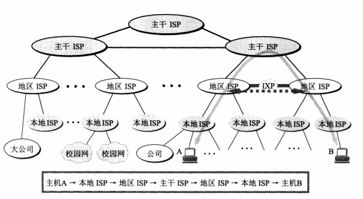
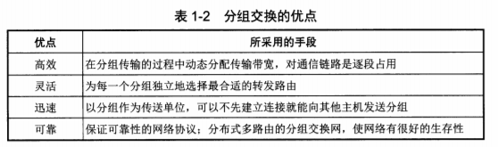
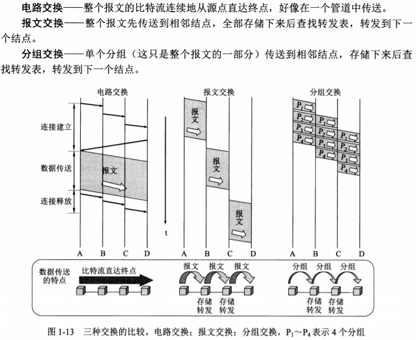
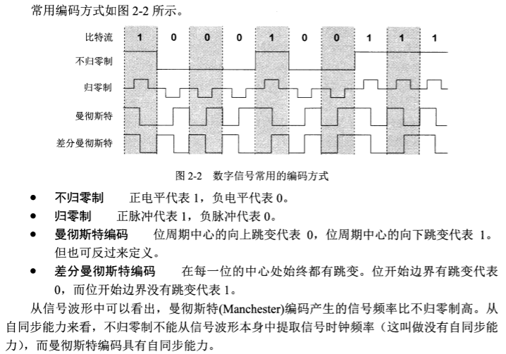
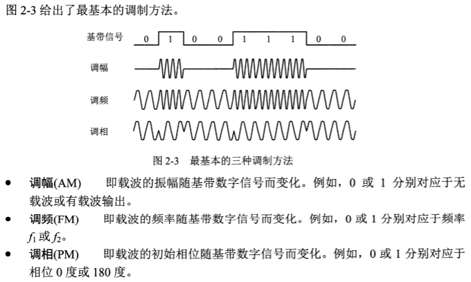
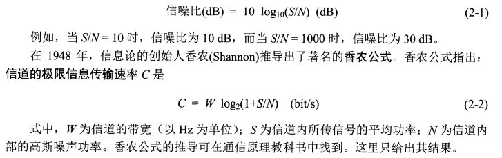
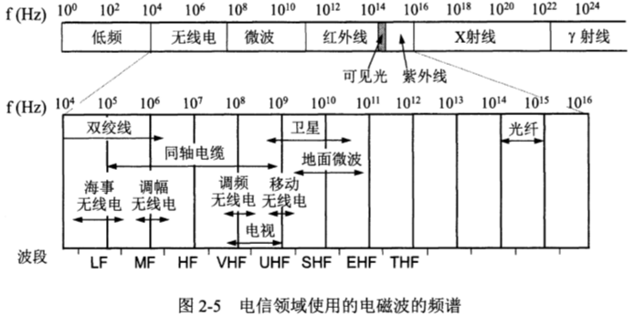
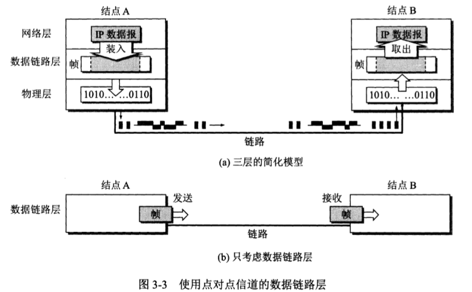

[toc]

[参考书籍](https://book.douban.com/subject/26960678/)

## 第 1 章	概述

### 1.1 计算机网络在信息时代中的作用

21世纪的重要特征：数字化，网络化和信息化，它是一个以网络为核心的信息时代。

三大类熟悉的网络：电信网络，有线电视网络和计算机网络。

互联网具有的两个重要基本特点：连通性和共享（即资源共享）。

### 1.2 互联网概述

#### 1.2.1 网络的网络

计算机网络由若干结点和连接在这些结点的链路组成。

网络中的结点可以是计算机，集线器，交换机或路由器。

互连网：网络之间还可以通过路由器互连起来，这样就构成了一个覆盖范围更大的网络，这样的网络称为互连网（即网络的网络）。

网络把许多计算机连接在一起，而互连网则把许多网络通过路由器连接在一起。与网络相连的计算机常称为主机。

#### 1.2.2 互联网基础结构发展的三个阶段

三个阶段在时间划分上并非截然分开而是有部分重叠的，因为网络的演进是逐渐的而并非在某个日期发生突变。

> 第一阶段：从单个网络ARPANET向互连网发展的过程

区别internet和Internet：

internet：互连网，是一个通用名词，它泛指由多个计算机网络互连而成的计算机网络。网络间的通信协议可任意选择而非要使用TCP/IP协议。

Internet：互联网，是一个专用名词，它指当前全球最大的，开放的，由众多网络相互连接而成的特定互连网，它采用TCP/IP协议族作为通信的规则，且其前身是美国的ARPANET。

> 第二阶段：特点是建成了三级结构的互联网

三级计算机网络：分为主干网，地区网和校园网（或企业网）

> 第三阶段：特点是逐渐形成了多层次ISP结构的互连网

ISP：互联网服务提供商

现在的互联网已不是某个单个组织所拥有而是全世界无数大大小小的ISP所共同拥有的，这也是互联网称为网络的网络的网络的原因。

ISP依据提供服务的覆盖面积大小以及拥有的IP地址数目的不同，也分为不同层次的ISP：主干ISP，地区ISP和本地ISP。

**IXP：互联网交换点**

主要作用：允许两个网络直接相连并交换分组，而不需要再通过第三个网络来转发分组。

使得互联网上的数据流量分布更加合理，同时减少了分组转发的迟延时间，降低了分组转发的费用。

#### 1.2.3 互联网的标准化工作

互联网草案

建议标准

互联网标准

### 1.3 互联网的组成

边缘部分：由所有连接在互联网上的主机组成。这部分是用户直接使用的，用来进行通信（传送数据，音频或视频）和资源共享。

核心部分：由大量网络和连接这些网络的路由器组成，这部分是为边缘部分提供服务的（提供连通性和交换）。

#### 1.3.1 互联网的边缘部分

处在互联网边缘的部分就是连接在互联网上的所有的主机，这些主机又称为端系统。

端系统之间的通信方式通常可以划分为两大类：客户-服务器方式（C/S方式）和对等方式（P2P方式）。

> 客户-服务器方式

客户和服务器都是指通信中所涉及的两个应用进程。客户-服务器方式所描述的是进程之间的服务和被服务的关系。

客户是服务请求方，服务器是服务提供方，两者均需要使用网络核心部分所提供的服务。

主要特点：

客户程序：

（1）被用户调用后运行，在通信时主动向远地服务器发起通信（请求服务），因此，客户程序必须知道服务器程序的地址。

（2）不需要特殊的硬件和很复杂的操作系统。

服务器程序：

（1）是一种专门用来提供某种服务的程序，可同时处理多个远地或本地客户的请求。

（2）系统启动后即自动调用并一直不断地运行着，被动地等待并接受来自各地的客户地通信请求。因此，服务器程序不需要知道客户程序的地址，

（3）一般需要有强大的硬件和高级的操作系统支持。

客户与服务器的通信关系建立后，通信可以是双向的，客户和服务器都可发送和接收数据。

（上述客户和服务器本来指的都是计算机进程（软件））

> 对等连接方式

两台主机在通信时并不区分哪一个是服务请求方，哪一个是服务提供方。只要两台主机都运行了对等连接软件（P2P软件），它们就可以进行平等的，对等连接通信，这种工作方式也称为P2P方式。

#### 1.3.2 互联网的核心部分

在网络核心部分其特殊作用的是路由器，是一种专用计算机但非主机，是实现分组交换的关键构件，其任务是转发收到的分组，这是网络核心部分最重要的功能

> 电路交换的主要特点

从通信资源的分配角度来看，交换就是按照某种方式的动态地分配传输线路的资源

电路交换：建立连接（占用通信资源）\==>通话（一直占用通信资源）==>释放资源（归还通信资源）

一个重要特点：在通话的全部时间内，通话的两个用户始终占用端到端的通信资源

该种方式的线路的传输效率往往很低

> 分组交换的主要特点

分组交换采用存储转发技术，通常将需要发送的整块数据（即一个报文）划分为几个分组后在进行传送，发送报文前，先把较长的报文划分为一个个更小的等长数据段，在每一个数据段前加上一些由必要的控制信息组成的首部（包头）后则构成一个分组（包）。

分组是在互联网中传送的数据单元，首部包含了如目的地址和源地址等重要控制信息。

位于网络边缘的主机和位于网络核心部分的路由器都是计算机，但是它们的作用却很不一样：

主机是为用户进行信息处理的，并且可以和其他主机通过网络交换信息。

路由器是用来转发分组的，即进行分组交换的。

> 三种交换方式在数据交换阶段的主要特点

### 1.4 计算机网络在我国的发展

### 1.5 计算机网络的类别

> 按照网络的作用范围进行分类

- 广域网WAN
- 城域网MAN
- 局域网LAN
- 个人局域网PAN

> 按照网络的使用者进行分类

- 公用网

- 专用网

> 用来把用户接入到互联网的网络

即接入网，又称为本地接入网或居民接入网

### 1.6 计算机网络的性能（）

#### 1.6.1 计算机网络的性能指标

#### 1.6.2 计算机网络的非性能指标

- 费用
- 质量
- 标准化
- 可靠性
- 可扩展性和可升级性
- 易于管理和维护

### 1.7 计算机网络体系结构（）

## 第 2 章	物理层

### 2.1 物理层的基本概念

可以将物理层的主要任务描述为确定与传输媒体的接口有关的一些特性，即：

- 机械特性
- 电气特性
- 功能特性
- 过程特性

数据在计算机内部多采用并行传输方式，但数据在通信线路（传输媒体）上的传输方式一般都是串行传输。

### 2.2 数据通信的基础知识

#### 2.2.1 数据通信系统的模型

一个数据通信系统可划分为三大部分，即源系统（或发送端，发送方），传输系统（或传输网络），和目的系统（或接收端，接收方）。

> 源系统一般包括以下两个部分：

- 源点（源站，信源）

- 发送器

> 目的系统一般包括以下两个部分：

- 接收器

- 终点（目的站，信宿）

通信的目的是传送消息。

数据是运送消息的实体。

数据是使用特定方式表示的信息，通常是有意义的符号序列。

信号是数据的电气或电磁的表现。

> 根据信号中代表信息的参数的取值方式不同，可将信号分为两大类

- 模拟信号（连续信号）
- 数字信号（离散信号）

代表不同离散数值的基本波形就称为码元。

#### 2.2.2 有关信道的几个基本概念

信道与电路并不等同，信道一般都是用来表示向某一个方向传送信息的媒体，因此一条通信电路往往包含一条发送信道和一条接收信道

> 从通信的双方信息交互的方式来看，可以有以下三种方式

- 单向通信（单工信道）
- 双向交替通信（半双工信道）
- 双向同时通信（全双工信道）

来自信源的信号常沉称为基带信号（即基本频带信号）

> 调制

基带信号往往包含有较多的低频成分，甚至有直流成分，而许多信道并不能传输这种低频分量或直流分量，需要通过对基带信号进行调制解决这一问题

- 基带调制

  仅对基带信号的波形进行变换，使他能够与信道特性相适应，变换的信号后仍然是基带信号（过程称为编码）

- 带通调制

  使用载波进行调制，那基带信号的频率搬移到较高的频段，并转换为模拟信号这样就能更好地在模拟信道中传输，经过载波调制后的信号称为带通信号（仅在一段频率范围内能够通过信道）

一个码元所携带的信息量是不固定的，而是由调制方法和编码方式决定的。

> 常用编码方式

> 基本的带通调制方法

为达到更高的信息传输速率，必须采用技术上更为复杂的多元制的振幅相位混合调制方法如正交振幅调制QAM

#### 2.2.3 信道的极限容量

> 概念上限制码元在信道上的传输速率的因素

- 信道能够通过的频率范围

  码间串扰：信号中高频分量在传输时受到衰减，接收端接收到的波形前后沿不再那么陡峭，失去码元之间的清晰界限。

  在任何信道中，码元传输的速率是有上限的，传输速率超过此上限就会出现严重的码间串扰的问题，使接收端对码元的判决（识别）成为不可能。

- 信噪比

  信噪比就是信号的平均功率和噪声的平均功率之比，常记作S/N （单位dB），即：

香农公式表明：信道的带宽或信噪比越大，信息的极限传输速率就越高

意义：只要信息传输的速率低于信道的极限信息传输速率，那么一定存在一种方式实现无差错的传输

对于频带宽度已经确定的信道，如果信噪比不能再提高，并且码元的传输苏也达到了上限值，可以通过让每一个码元携带更多比特的信息量来提高信息的传输量。

### 2.3 物理层下面的传输媒体

传输媒体也称为传输介质或传输媒介，它就是数据传输系统中在发送器和接收器之间的物理通路，分为两大类：

- 导引型传输媒体（电磁波沿着固体媒介传播）
- 非导引型传输媒体（指自由空间，其中电磁波的传播称为无线传输）

#### 2.3.1 导引型传输媒体

- 双绞线

- 同轴电缆

- 光缆

  光纤的优点：

  - 传输损耗小，中继距离长，对远距离传输特别经济
  - 抗雷电和电磁干扰性能好
  - 无串音干扰，保密性好，不易被窃听或者截取数据
  - 体积小，重量轻

- 架空明线（基本不用）

#### 2.3.2 非引导型传输媒体

接力：在一条微波通信信道的两个终端之间建立若干个中继站，中继站把前一站送来的信号经过放大后再发送到下一站

> 微波接力通信的主要特点

- 通信信道的容量很大（微波波段频率高，频段范围宽）
- 微波传输质量高（工业干扰和天电干扰主要频谱成分比微波频率低得多，对其危害小）
- 与相同容量和长度的电缆载波通信相比，微波接力通信建设投资少，见效快，易于跨越山区，河流

> 微波接力通信的缺点

- 相邻站之间必须直视，不能有障碍物，有时一个天线发射出的信号也会分成几条略有差别的路径到达接收天线，因而造成失真
- 微波的传播有时也会受到恶劣气候的影响
- 与电缆通信比较，微波通信的隐蔽性和保密性较差
- 对大量中继站的使用和维护需要耗费较多的人力和物力

### 2.4 信道复用技术（）

#### 2.4.1 频分复用、时分复用和统计时分复用

#### 2.4.2 波分复用

#### 2.4.3 码分复用

### 2.5 数字传输系统（）

### 2.6 宽带接入技术（）

## 第 3 章	数据链路层

> 数据链路层使用的信道主要有以下两种类型

- 点对点信道：一对一的点对点的通信方式
- 广播信道：一对多的广播通信方式

### 3.1 使用点对点信道的数据链路层

#### 3.1.1 数据链路和帧

> 链路和数据链路

- 链路：从一个结点到相邻结点的一段物理线路（有线或无线），而中间没有任何其他的交换结点，链路只是一条路径的组成部分
- 数据链路：当需要在一条线路上传送数据时，除了必须有一条物理线路外，还必须有一些必要的协议来控制这些数据的传输，实现这些协议的硬件和软件加到链路上，就构成了数据链路

一般使用网络适配器（包含硬件和软件）来实现这些协议，一般的适配器包括了数据链路层和物理层这两层的功能

早期的数据通信协议叫做通信规程

> 帧

帧：点对点信道的数据链路层的协议数据单元

数据链路层把网络层交下来的数据构成帧发送到链路上，以及把接收到的帧中的数据取出并上交给网络层。

互联网中网络层的协议数据单元就是IP数据报（或简称为数据报，分组或包）

> 点对点信道的数据链路层在进行通信时的主要步骤

1. 结点A的数据链路层把网络层交下来的IP数据报添加首部和尾部封装成帧
2. 结点A把封装好的帧发送给结点B的数据链路层
3. 若结点B的数据链路层收到的帧无差错，则从收到的帧中提取出IP数据报交给上面的网络层，否则丢弃这个帧

数据链路层不必考虑物理层如何实现比特传输的细节，甚至可以更简单地设想好像是沿着两个数据链路层之间的水平方向把帧直接发送给对方

#### 3.1.2 三个基本问题

> 封装成帧

封装成帧：在一段数据的前后分别添加首部和尾部，这样就构成了一个帧（首部和尾部的重要作用是进行帧定界，此外还包括许多必要的控制信息）

为了提高帧的传输效率，应当使帧的数据部分长度尽可能地大于首部和尾部的长度，但是每一种链路层协议都规定了所能传送的帧的数据部分长度上限（最大传送单元MTU）

当数据是可打印的ASCII码组成的文本文件时，帧定界可以使用特殊的帧定界符，ASCLL码中可打印的95个，不可打印的控制字符33个，控制字符SOH（二进制00000001）表示帧的首部的开始，EOT（二进制00000100）表示帧的结束

当数据在传输中出现差错时，帧定界符的作用更加明显，通过接收到的数据是否有SOH和EOT来确定其是否为一个完整的帧来决定是否接收

> 透明传输

问题：当传输的数据为非ASCII码的文本文件时，数据中的某个字节的二进制编码可能正好和某些控制字符一样，导致帧定界的错误

解决方法：（字节填充/字符填充）发送端的数据链路层在数据中出现控制字符“SOH”，“EOT”的前面插入一个转义字符“ESC”（十六进制编码为1B），而在接收端的数据链路层把数据送往网络层之前删除这个插入的转义字符，若转义字符也出现在数据中，那么在其前面再加上一个转义字符，连续接收到转义字符就删去前面一个

> 差错校验

比特差错：比特再传输过程中可能会出现差错，1可能变成0，0也可能变成1

误码率（BER）：在一段数间内，传输错误的比特占所传输比特总数的比率

目前在数据链路层广泛使用了循环冗余校验CRC的检错技术

帧校验序列FCS：为了进行检错而添加的冗余码

区别FCS和CRC：CRC时一种检错方法，而FCS时添加在数据后面的冗余码，检错方法上可选用CRC，也可以不选用CRC

在数据链路层若仅仅是采用循环冗余校验CRC差错校验技术，则只能做到对帧的无差错接受，即：凡是接收端数据链路层接受的帧，我们都能以非常接近于1的概率认为这些帧在传输的过程中没有产生差错。接收端丢弃的帧虽然曾收到了，但最终还是以为有差错而被丢弃，上述可近似表述为：凡是接收端数据链路层接受的帧均无差错

可靠传输：数据链路层的发送端发送什么，在接收端就收到什么。

传输差错分为两大类：一类是最基本的比特差错，另一类是传输差错（接收到的帧美誉出现比特差错，但是出现了帧丢失，帧重复，或帧失序），CRC校验仅能实现无比特差错的传输，但非可靠传输，在此基础增加帧编号、确认和重传机制。

对通信质量良好的有线传输链路，数据链路层协议不适用确认和重传机制，若在数据链路层传输数据时出现了差错并且需要进行改正，那么由上层协议（如运输层的TCP协议）来完成，对于通信质量差的无线传输链路，数据链路层协议使用确认和重传机制，向上层提供可靠传输的服务。

### 3.2 点对点协议PPP

#### 3.2.1 PPP协议的特点

> PPP协议应满足的需求

- 简单
- 封装成帧
- 透明性
- 多种网络协议
- 多种类型链路
- 差错检测
- 检测连接状态
- 最大传送单元
- 网络层地址协商
- 数据压缩协商

> PPP协议的组成

- 一个将IP数据报封装到串行链路的方法
- 一个用来建立、配置和测试数据链路连接的链路控制协议LCP
- 一套网络控制协议NCP

#### 3.2.2 PPP协议的帧格式

> 各字段的意义