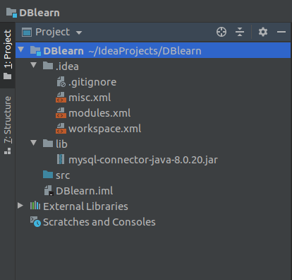

## 目录

[toc]


## 1. 数据库驱动

应用程序通过数据库驱动和数据库进行数据交换

## 2. JDBC

SUN公司为了简化开发人员的（对数据库的统一）操作，提供了一个（Java操作数据库）的规范，俗称JDBC，这些规范的实现由具体的厂商去做。

java.sql

javax.sql

还需要导入一个数据库驱动包

驱动下载地址（清华源）：[点击跳转](https://mirrors.tuna.tsinghua.edu.cn/mysql/downloads/Connector-J/)

## 3. 第一个JDBC程序

1. 创建测试数据库


2. 导入数据库驱动

新建项目后，在项目目录下新建一个lib文件夹，然后将数据库驱动jar包复制进该目录，完成后文件夹结构如图所示



然后右键lib文件夹，点击Add as Library，这时才算将驱动导入项目中

3. 编写测试代码

```java
package com;

import java.sql.*;

public class TestConnect {
    public static void main(String[] args) throws ClassNotFoundException, SQLException {
        //1.加载驱动
        Class.forName("com.mysql.cj.jdbc.Driver");
        //2.用户信息和url
        String url="jdbc:mysql://localhost:3306/info?serverTimezone=UTC&useUnicode=true&characterEncoding=utf8&useSSL=true";
        String username="root";
        String password="root";
        //3.连接成功，数据库对象
        Connection connection= DriverManager.getConnection(url,username, password);
        //4.执行SQL的对象去执行SQL
        Statement statement=connection.createStatement();
        //5.执行SQL的对象去执行SQL，可能存在结果，查看返回结果
        String sql="SELECT * FROM Student";
        ResultSet resultSet=statement.executeQuery(sql);
        while(resultSet.next()){
            System.out.println("id:"+resultSet.getObject("Sno"));
            System.out.println("name:"+resultSet.getObject("Sname"));
            System.out.println("sex:"+resultSet.getObject("Ssex"));
            System.out.println("age:"+resultSet.getObject("Sage"));
            System.out.println("dept:"+resultSet.getObject("Sdept"));
            System.out.println("==================================");
        }
        //6.释放连接
        resultSet.close();
        statement.close();
        connection.close();
    }
}
```


> 步骤总结：
>
> 1. 加载驱动
> 2. 连接数据库DriverManager
> 3. 获得执行sql的对象Statement
> 4. 获得返回的结果集
> 5. 释放连接

> DriverManager

```java
//DriveManager.registerDriver(new com.mysql.cj.jdbc.Driver());
//不推荐上面的写法，因为上面的源码实质上已经注册了一次驱动，从而导致驱动被重复驱动
Class.forName("com.mysql.cj.jdbc.Driver");//固定写法
```

> URL

```java
String url="jdbc:mysql://localhost:3306/info?serverTimezone=UTC&useUnicode=true&characterEncoding=utf8&useSSL=true";
//mysql -- 3306
//格式：jdbc:mysql（协议）://主机地址:端口号/数据库名?参数1&参数2&参数n
//oralce -- 1521
//格式： jdbc:oracle:thin:@localhost:1521:sid
```

> Connection 代表数据库

```java
connection.setAutoCommit();//数据库设置自动提交
connection.commit();//事务提交
connection.rollback();//事务回滚
```

> Statement 执行SQL的对象	PrepareStatement 执行SQL的对象

```java
String sql="SELECT * FROM users";//编写SQL
statement.executeQuery();//查询操作，返回Result
statement.execute();//执行任何SQL语句
statement.excuteUpdate();//更新、插入、删除都是用这个，返回一个受影响的行数
```

> ResultSet 查询的结果集：封装了所有的查询结果

```java
//若不知道类型的情况下使用
resultSet.getObject();
//知道类型的情况下使用
resultSet.getString();
resultSet.getInt();
resultSet.getFloat();
resultSet.getDate();
//...
//通过指针进行遍历
resultSet.beforeFirst();//移动到最前面
resultSet.afterLast();//移动到最后面
resultSet.next();//移动到下一个数据
resultSet.previous();//移动到前一行
resultSet.absoulute(row);//移动到指定行
```

> 释放资源

```java
//耗资源，用完关闭
resultSet.close();
statement.close();
connection.close();
```

4. 测试结果


## 4.statement对象

JDBC中的Statement对象用于向数据库发送SQL语句，想完成对数据库的增删改查，只需要通过这个歌对象向数据库发送增删改查语句即可。

Statement对象的executeUpdate方法，用于向数据库发送增删改的语句，executeUpdate执行完后，将会返回一个整数（即增删改语句导致了数据库几行数据发生了变化）。

Statement对象的executeQuery方法用于向数据库发送查询语句，executeQuery方法返回代表查询结果的ResultSet对象。

> CRUD操作-create

```java
//使用executeUpdate(String sql)方法完成数据添加操作
Statement st=conn.createStatement();
String sql="INSERT INTO user(...) VALUES(...)";
int num=st.executeUpdate(sql);
if(num>0){
	System.out.println("插入成功！");
}
```

> CRUD操作-delete

```java
//使用executeUpdate(String sql)方法完成数据删除操作
Statement st=conn.createStatement();
String sql="DELETE FROM user WHERE id=1";
int num=st.executeUpdate(sql);
if(num>0){
	System.out.println("删除成功！");
}
```

> CRUD操作-update

```java
//使用executeUpdate(String sql)方法完成数据修改操作
Statement st=conn.createStatement();
String sql="UPDATE user SET name='...' WHERE name='...'";
int num=st.executeUpdate(sql);
if(num>0){
	System.out.println("修改成功！");
}
```

> CRUD操作-read

```java
//使用executeQuery(String sql)方法完成数据查询操作
Statement st=conn.createStatement();
String sql="SELECT * FROM user WHERE id=1";
ResultSet rs=st.executeQuery(sql);
while(rs.next()){
	//根据获取列的数据类型，分别调用rs的相应方法映射
}
```

> 代码实现