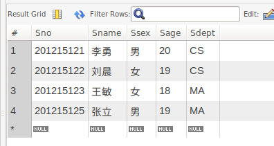

Mybatis

[toc]

## 1. 简介

[官网网址](https://mybatis.org/mybatis-3/)

## 2. 第一个Mybatis程序

###  2.1 搭建环境

搭建数据库



新建项目

1. 新建一个Maven项目

   确定使用的是自己的Maven，并且检查本地库地库

2. 删除src目录（不需要建立子工程的可不用）

   方便建立子工程

3. 导入maven依赖

```xml
<!--mysql-->
<!-- https://mvnrepository.com/artifact/mysql/mysql-connector-java -->
<dependency>
    <groupId>mysql</groupId>
    <artifactId>mysql-connector-java</artifactId>
    <version>8.0.16</version>
</dependency>

<!---junit->
<!-- https://mvnrepository.com/artifact/org.junit.jupiter/junit-jupiter-api -->
<dependency>
    <groupId>org.junit.jupiter</groupId>
    <artifactId>junit-jupiter-api</artifactId>
    <version>5.6.2</version>
    <scope>test</scope>
</dependency>

<!--mybatis-->
<!-- https://mvnrepository.com/artifact/org.mybatis/mybatis -->
<dependency>
    <groupId>org.mybatis</groupId>
    <artifactId>mybatis</artifactId>
    <version>3.4.6</version>
</dependency>
```

之后右键pom.xml--->Maven--->Reload project

在External Libraries中查看相关包是否导入成功

### 2.2 创建一个模块

- 编写mybatis的核心配置文件

```xml
<?xml version="1.0" encoding="UTF-8" ?>
<!DOCTYPE configuration
        PUBLIC "-//mybatis.org//DTD Config 3.0//EN"
        "http://mybatis.org/dtd/mybatis-3-config.dtd">
<!--configuration核心配置文件-->
<configuration>
    <environments default="development">
        <environment id="development">
            <transactionManager type="JDBC"/>
            <dataSource type="POOLED">
                <property name="driver" value="com.mysql.cj.jdbc.Driver"/>
                <property name="url" value="jdbc:mysql://localhost:3306/test?serverTimezone=UTC&amp;useUnicode=true&amp;characterEncoding=utf8&amp;useSSL=true"/>
                <property name="username" value="root"/>
                <property name="password" value="root"/>
            </dataSource>
        </environment>
    </environments>

</configuration>
```


- 编写mybatis工具类

```java
//SqlSessionFactory--->sqlSession
public class MybatisUtil {
    private static SqlSessionFactory sqlSessionFactory;
    static{
        try{
            //1. 获取SqlSessionFactory对象
            String resource = "mybatis-config.xml";
            InputStream inputStream = Resources.getResourceAsStream(resource);
            sqlSessionFactory = new SqlSessionFactoryBuilder().build(inputStream);
        }catch (IOException e){
            e.printStackTrace();
        }
    }

    //既然有了 SqlSessionFactory，顾名思义，我们可以从中获得 SqlSession 的实例
    //SqlSession 提供了在数据库执行 SQL 命令所需的所有方法
    public static SqlSession getSqlSession(){
        return sqlSessionFactory.openSession();
    }
}
```

### 2.3编写代码

- 实体类

```java
package com.pojo;

public class User {
    privete int id;
    private String username;
    private String password;

    public User() {
    }

    public User(int id, String username, String password) {
        this.id = id;
        this.username = username;
        this.password = password;
    }

    public int getId() {
        return id;
    }

    public String getUsername() {
        return username;
    }

    public String getPassword() {
        return password;
    }

    public void setId(int id) {
        this.id = id;
    }

    public void setUsername(String username) {
        this.username = username;
    }

    public void setPassword(String password) {
        this.password = password;
    }

    @Override
    public String toString() {
        return "User{" +
                "id=" + id +
                ", username='" + username + '\'' +
                ", password='" + password + '\'' +
                '}';
    }
}

```

- Dao接口

```java
package com.dao;

import java.util.List;

public class UserDao {
    List<User> getUserList();
}
```

- 接口实现类由原来的impl转变为一个Mapper配置文件

```xml
<?xml version="1.0" encoding="UTF-8" ?>
<!DOCTYPE mapper
        PUBLIC "-//mybatis.org//DTD Mapper 3.0//EN"
        "http://mybatis.org/dtd/mybatis-3-mapper.dtd">
<!--namespace=绑定一个对应的Dao/Mapper接口-->
<mapper namespace="com.dao.UserDao">
    <select id="getUserList"resultType="com.pojo.User">
        select * from test.user 
    </select>
</mapper>
```

### 2.4 测试

- junit测试