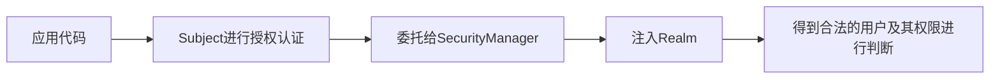

[toc]

## 1. Shiro简介

[官方网址](http://shiro.apache.org/)

Apache Shiro 是 Java 的一个安全框架。目前，使用 Apache Shiro 的人越来越多，因为它相当简单，对比 Spring Security，可能没有其做的功能强大，但是在实际工作时可能并不需要那么复杂的东西，所以使用小而简单的 Shiro 就足够了。

Shiro 可以非常容易的开发出足够好的应用，其不仅可以用在 JavaSE 环境，也可以用在 JavaEE 环境。Shiro 可以帮助我们完成：认证、授权、加密、会话管理、与 Web 集成、缓存等。


**Authentication**：身份认证 / 登录，验证用户是不是拥有相应的身份；

**Authorization**：授权，即权限验证，验证某个已认证的用户是否拥有某个权限；即判断用户是否能做事情，常见的如：验证某个用户是否拥有某个角色。或者细粒度的验证某个用户对某个资源是否具有某个权限；

**Session** **Management**：会话管理，即用户登录后就是一次会话，在没有退出之前，它的所有信息都在会话中；会话可以是普通 JavaSE 环境的，也可以是如 Web 环境的；

**Cryptography**：加密，保护数据的安全性，如密码加密存储到数据库，而不是明文存储；

**Web Support**：Web 支持，可以非常容易的集成到 Web 环境；

**Caching**：缓存，比如用户登录后，其用户信息、拥有的角色 / 权限不必每次去查，这样可以提高效率；

**Concurrency**：shiro 支持多线程应用的并发验证，即如在一个线程中开启另一个线程，能把权限自动传播过去；

**Testing**：提供测试支持；

**Run As**：允许一个用户假装为另一个用户（如果他们允许）的身份进行访问；

**Remember Me**：记住我，这个是非常常见的功能，即一次登录后，下次再来的话不用登录了。

**Shiro 不会去维护用户、维护权限；这些需要我们自己去设计 / 提供；然后通过相应的接口注入给 Shiro 即可。**

>外部角度（从应用程序角度的来观察如何使用 Shiro 完成工作）


应用代码直接交互的对象是 Subject，也就是说 Shiro 的对外 API 核心就是 Subject；

**各API的含义**

**Subject**：主体，代表了当前 “用户”，这个用户不一定是一个具体的人，与当前应用交互的任何东西都是 Subject，如网络爬虫，机器人等；即一个抽象概念；所有 Subject 都绑定到 SecurityManager，与 Subject 的所有交互都会委托给 SecurityManager；可以把 Subject 认为是一个门面；SecurityManager 才是实际的执行者；

**SecurityManager**：安全管理器；即所有与安全有关的操作都会与 SecurityManager 交互；且它管理着所有 Subject；可以看出它是 Shiro 的核心，它负责与后边介绍的其他组件进行交互，如果学习过 SpringMVC，你可以把它看成 DispatcherServlet 前端控制器；

**Realm**：域，Shiro 从从 Realm 获取安全数据（如用户、角色、权限），就是说 SecurityManager 要验证用户身份，那么它需要从 Realm 获取相应的用户进行比较以确定用户身份是否合法；也需要从 Realm 得到用户相应的角色 / 权限进行验证用户是否能进行操作；可以把 Realm 看成 DataSource，即安全数据源。

**最简单的一个Shiro应用：**



**从以上也可以看出，Shiro 不提供维护用户 / 权限，而是通过 Realm 让开发人员自己注入。**

> 内部角度


**Subject**：主体，可以看到主体可以是任何可以与应用交互的 “用户”；

**SecurityManager**：相当于 SpringMVC 中的 DispatcherServlet 或者 Struts2 中的 FilterDispatcher；是 Shiro 的心脏；所有具体的交互都通过 SecurityManager 进行控制；它管理着所有 Subject、且负责进行认证和授权、及会话、缓存的管理。

**Authenticator**：认证器，负责主体认证的，这是一个扩展点，如果用户觉得 Shiro 默认的不好，可以自定义实现；其需要认证策略（Authentication Strategy），即什么情况下算用户认证通过了；

**Authrizer**：授权器，或者访问控制器，用来决定主体是否有权限进行相应的操作；即控制着用户能访问应用中的哪些功能；

**Realm**：可以有 1 个或多个 Realm，可以认为是安全实体数据源，即用于获取安全实体的；可以是 JDBC 实现，也可以是 LDAP 实现，或者内存实现等等；由用户提供；注意：Shiro 不知道你的用户 / 权限存储在哪及以何种格式存储；所以我们一般在应用中都需要实现自己的 Realm；

**SessionManager**：如果写过 Servlet 就应该知道 Session 的概念，Session 呢需要有人去管理它的生命周期，这个组件就是 SessionManager；而 Shiro 并不仅仅可以用在 Web 环境，也可以用在如普通的 JavaSE 环境、EJB 等环境；所有呢，Shiro 就抽象了一个自己的 Session 来管理主体与应用之间交互的数据；这样的话，比如我们在 Web 环境用，刚开始是一台 Web 服务器；接着又上了台 EJB 服务器；这时想把两台服务器的会话数据放到一个地方，这个时候就可以实现自己的分布式会话（如把数据放到 Memcached 服务器）；

**SessionDAO**：DAO 大家都用过，数据访问对象，用于会话的 CRUD，比如我们想把 Session 保存到数据库，那么可以实现自己的 SessionDAO，通过如 JDBC 写到数据库；比如想把 Session 放到 Memcached 中，可以实现自己的 Memcached SessionDAO；另外 SessionDAO 中可以使用 Cache 进行缓存，以提高性能；

**CacheManager**：缓存控制器，来管理如用户、角色、权限等的缓存的；因为这些数据基本上很少去改变，放到缓存中后可以提高访问的性能

**Cryptography**：密码模块，Shiro 提高了一些常见的加密组件用于如密码加密 / 解密的。

## 2. Shiro身份验证

在应用中谁能证明他就是他本人。一般提供如他们的身份 ID 一些标识信息来表明他就是他本人，如提供身份证，用户名 / 密码来证明。

在 shiro 中，用户需要提供 principals （身份）和 credentials（证明）给 shiro，从而应用能验证用户身份：

**principals**：身份，即主体的标识属性，可以是任何东西，如用户名、邮箱等，唯一即可。一个主体可以有多个 principals，但只有一个 Primary principals，一般是用户名 / 密码 / 手机号。

**credentials**：证明 / 凭证，即只有主体知道的安全值，如密码 / 数字证书等。

## 3. Shiro 缓存机制

Shiro 提供了类似于 Spring 的 Cache 抽象，即 Shiro 本身不实现 Cache，但是对 Cache 进行了又抽象，方便更换不同的底层 Cache 实现。

对于 Cache 的一些概念可以参考[《Spring Cache 抽象详解》](http://jinnianshilongnian.iteye.com/blog/2001040)。

**Shiro 提供的 Cache 接口**：

```
public interface Cache<K, V> {
    //根据Key获取缓存中的值
    public V get(K key) throws CacheException;
    //往缓存中放入key-value，返回缓存中之前的值
    public V put(K key, V value) throws CacheException; 
    //移除缓存中key对应的值，返回该值
    public V remove(K key) throws CacheException;
    //清空整个缓存
    public void clear() throws CacheException;
    //返回缓存大小
    public int size();
    //获取缓存中所有的key
    public Set<K> keys();
    //获取缓存中所有的value
    public Collection<V> values();
}
```

**Shiro 提供的 CacheManager 接口**：

```
public interface CacheManager {
    //根据缓存名字获取一个Cache
    public <K, V> Cache<K, V> getCache(String name) throws CacheException;
}
```

**Shiro 还提供了 CacheManagerAware 用于注入 CacheManager**：

```
public interface CacheManagerAware {
    //注入CacheManager
    void setCacheManager(CacheManager cacheManager);
}
```

Shiro 内部相应的组件（DefaultSecurityManager）会自动检测相应的对象（如 Realm）是否实现了 CacheManagerAware 并自动注入相应的 CacheManager。

本章用例使用了与第六章的代码。

### Realm 缓存

Shiro 提供了 CachingRealm，其实现了 CacheManagerAware 接口，提供了缓存的一些基础实现；另外 AuthenticatingRealm 及 AuthorizingRealm 分别提供了对 AuthenticationInfo 和 AuthorizationInfo 信息的缓存。

**ini 配置**

```
userRealm=com.github.zhangkaitao.shiro.chapter11.realm.UserRealm
userRealm.credentialsMatcher=$credentialsMatcher
userRealm.cachingEnabled=true
userRealm.authenticationCachingEnabled=true
userRealm.authenticationCacheName=authenticationCache
userRealm.authorizationCachingEnabled=true
userRealm.authorizationCacheName=authorizationCache
securityManager.realms=$userRealm
cacheManager=org.apache.shiro.cache.ehcache.EhCacheManager
cacheManager.cacheManagerConfigFile=classpath:shiro-ehcache.xml
securityManager.cacheManager=$cacheManager&nbsp;
```

- userRealm.cachingEnabled：启用缓存，默认 false；
- userRealm.authenticationCachingEnabled：启用身份验证缓存，即缓存 AuthenticationInfo 信息，默认 false；
- userRealm.authenticationCacheName：缓存 AuthenticationInfo 信息的缓存名称；
- userRealm. authorizationCachingEnabled：启用授权缓存，即缓存 AuthorizationInfo 信息，默认 false；
- userRealm. authorizationCacheName：缓存 AuthorizationInfo 信息的缓存名称；
- cacheManager：缓存管理器，此处使用 EhCacheManager，即 Ehcache 实现，需要导入相应的 Ehcache 依赖，请参考 pom.xml；

因为测试用例的关系，需要将 Ehcache 的 CacheManager 改为使用 VM 单例模式： this.manager = new net.sf.ehcache.CacheManager(getCacheManagerConfigFileInputStream())； 改为 this.manager = net.sf.ehcache.CacheManager.create(getCacheManagerConfigFileInputStream())；

**测试用例**

```
@Test
public void testClearCachedAuthenticationInfo() {
    login(u1.getUsername(), password);
    userService.changePassword(u1.getId(), password + "1");
    RealmSecurityManager securityManager =
     (RealmSecurityManager) SecurityUtils.getSecurityManager();
    UserRealm userRealm = (UserRealm) securityManager.getRealms().iterator().next();   userRealm.clearCachedAuthenticationInfo(subject().getPrincipals());
    login(u1.getUsername(), password + "1");
}&nbsp;
```

首先登录成功（此时会缓存相应的 AuthenticationInfo），然后修改密码；此时密码就变了；接着需要调用 Realm 的 clearCachedAuthenticationInfo 方法清空之前缓存的 AuthenticationInfo；否则下次登录时还会获取到修改密码之前的那个 AuthenticationInfo；

```
@Test
public void testClearCachedAuthorizationInfo() {
    login(u1.getUsername(), password);
    subject().checkRole(r1.getRole());
    userService.correlationRoles(u1.getId(), r2.getId());
    RealmSecurityManager securityManager =
      (RealmSecurityManager) SecurityUtils.getSecurityManager();
    UserRealm userRealm = (UserRealm)securityManager.getRealms().iterator().next();   userRealm.clearCachedAuthorizationInfo(subject().getPrincipals());
    subject().checkRole(r2.getRole());
}&nbsp;
```

和之前的用例差不多；此处调用 Realm 的 clearCachedAuthorizationInfo 清空之前缓存的 AuthorizationInfo；

另外还有 clearCache，其同时调用 clearCachedAuthenticationInfo 和 clearCachedAuthorizationInfo，清空 AuthenticationInfo 和 AuthorizationInfo。

UserRealm 还提供了 clearAllCachedAuthorizationInfo、clearAllCachedAuthenticationInfo、clearAllCache，用于清空整个缓存。

在某些清空下这种方式可能不是最好的选择，可以考虑直接废弃 Shiro 的缓存，然后自己通过如 AOP 机制实现自己的缓存；[可以参考](https://github.com/zhangkaitao/es/tree/master/web/src/main/java/com/sishuok/es/extra/aop)

另外如果和 Spring 集成时可以考虑直接使用 Spring 的 Cache 抽象，可以考虑使用 SpringCacheManagerWrapper，其对 Spring Cache 进行了包装，转换为 Shiro 的 CacheManager [实现](
https://github.com/zhangkaitao/es/blob/master/web/src/main/java/org/apache/shiro/cache/spring/SpringCacheManagerWrapper.java)

### Session 缓存

当我们设置了 SecurityManager 的 CacheManager 时，如：

```
securityManager.cacheManager=$cacheManager
```

当我们设置 SessionManager 时：

```
sessionManager=org.apache.shiro.session.mgt.DefaultSessionManager
securityManager.sessionManager=$sessionManager&nbsp;
```

如 securityManager 实现了 SessionsSecurityManager，其会自动判断 SessionManager 是否实现了 CacheManagerAware 接口，如果实现了会把 CacheManager 设置给它。然后 sessionManager 会判断相应的 sessionDAO（如继承自 CachingSessionDAO）是否实现了 CacheManagerAware，如果实现了会把 CacheManager 设置给它；如第九章的 MySessionDAO 就是带缓存的 SessionDAO；其会先查缓存，如果找不到才查数据库。

对于 CachingSessionDAO，可以通过如下配置设置缓存的名称：

```
sessionDAO=com.github.zhangkaitao.shiro.chapter11.session.dao.MySessionDAO
sessionDAO.activeSessionsCacheName=shiro-activeSessionCache&nbsp;
```

activeSessionsCacheName 默认就是 shiro-activeSessionCache。

[参考文档](https://www.w3cschool.cn/shiro/)


应用代码通过 Subject 来进行认证和授权，而 Subject 又委托给 SecurityManager；

我们需要给 Shiro 的 SecurityManager 注入 Realm，从而让 SecurityManager 能得到合法的用户及其权限进行判断。

Shiro 使用了与 Servlet 一样的 Filter 接口进行扩展