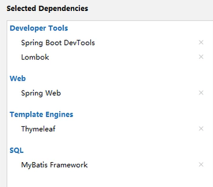
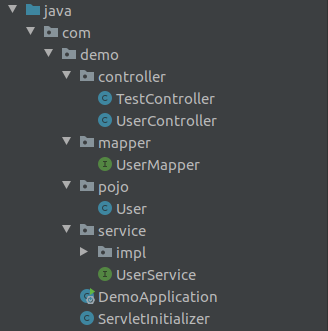
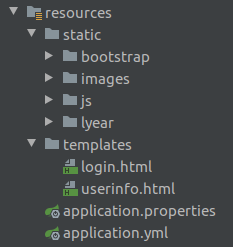

[toc]

## 1. 创建SpringBoot项目

可以选择阿里镜像进行创建，在Custom中填入下列网址进行创建即可

[阿里源](https://start.aliyun.com/)



## 2. 配置application.yml文件

```yml
server:
  port: 8080

spring:
  datasource:
    username: root
    password: zhou20010311
    url: jdbc:mysql://localhost:3306/test?useUnicode=true&characterEncoding-utf-8&serverTimezone=UTC&useSSL=true
    driver-class-name: com.mysql.cj.jdbc.Driver

  thymeleaf:
    cache: false
    prefix: classpath:/templates/
    suffix: .html
    encoding: UTF-8
    mode: HTML5
    servlet:
      content-type: text/html
```

## 3. 测试

src目录下新建java文件中新建com.demo.controller包，包内新建TestController.java

```java
package com.demo.controller;

import org.springframework.stereotype.Controller;
import org.springframework.web.bind.annotation.RequestMapping;

@Controller
public class TestController {
    @RequestMapping("/")
    public String test(){
        return "login;
    }
}
```

另外在resources下的templates目录下新建用于测试的login.html文件

```html
<!DOCTYPE html>
<html lang="en">
<head>
    <meta charset="UTF-8">
    <title>Title</title>
</head>
<body>
springboot
</body>
</html>
```

浏览器进入8080端口查看网页展示内容进行测试

## 4. 读取数据库

java文件夹下目录结构：



> com.demo.controller.UserController

对页面展示进行控制，具体包括展示的形式和所需要进行展示的html文件，分页控制需要引入pagehepler插件，在pom.xml中添加如下依赖即可。

```xml
 <dependency>
            <groupId>com.github.pagehelper</groupId>
            <artifactId>pagehelper-spring-boot-starter</artifactId>
            <version>1.2.12</version>
        </dependency>
```

源代码：

```java
package com.demo.controller;

import com.demo.pojo.User;
import com.demo.service.UserService;
import com.github.pagehelper.PageHelper;
import com.github.pagehelper.PageInfo;
import org.springframework.beans.factory.annotation.Autowired;
import org.springframework.stereotype.Controller;
import org.springframework.ui.Model;
import org.springframework.web.bind.annotation.RequestMapping;
import org.springframework.web.bind.annotation.RequestParam;

import java.util.List;

@Controller
public class UserController {
    @Autowired
    private UserService userService;

    @RequestMapping("/userlist")
    public String selectUserAll(@RequestParam(value = "pageNum",defaultValue = "1") Integer pageNum,
                                @RequestParam(value = "pageSize",defaultValue = "3") Integer pageSize,
                                Model model){

        //引入pagehepler插件
        PageHelper.startPage(pageNum,pageSize);
        List<User> list = userService.selectUserAll();
        //PageInfo封装分页信息
        PageInfo<User> pageInfo = new PageInfo<User>(list);
        model.addAttribute("userPageInfo",pageInfo);
        model.addAttribute("list",list);
        //ModelAndView modelAndView = new ModelAndView("userinfo","list",userService.selectUserAll());
//        modelAndView.addObject(userService.selectUserAll());
//        modelAndView.setViewName("list");
        return "userinfo";
    }
}
```

> com.demo.mapper.UserMapper

用于提供数据库到User类的映射

```java
package com.demo.mapper;

import com.demo.pojo.User;
import org.apache.ibatis.annotations.Mapper;
import org.apache.ibatis.annotations.Select;

import java.util.List;

@Mapper
public interface UserMapper {

    @Select("select * from user")
    public List<User> selectUserAll();
}

```

> com.pojo.User

定义User类，用于和数据库中所需要查询的信息对应

```java
package com.demo.pojo;

public class User {
    private Integer id;
    private String username;
    private String password;

    public Integer getId() {
        return id;
    }

    public String getUsername() {
        return username;
    }

    public String getPassword() {
        return password;
    }

    public void setId(Integer id) {
        this.id = id;
    }

    public void setUsername(String username) {
        this.username = username;
    }

    public void setPassword(String password) {
        this.password = password;
    }

    @Override
    public String toString() {
        return "User{" +
                "id=" + id +
                ", username='" + username + '\'' +
                ", password='" + password + '\'' +
                '}';
    }

    public User() {
    }
}

```

> com.demo.service.UserService

对数据库中数据进行查询，以list的形式进行存储

```java
package com.demo.service;

import com.demo.pojo.User;

import java.util.List;

public interface UserService {
    public List<User> selectUserAll();
}
```

> com.demo.service.impl.UserServiceImpl

对UserService接口的具体实现

```java
package com.demo.service.impl;

import com.demo.mapper.UserMapper;
import com.demo.pojo.User;
import com.demo.service.UserService;
import org.springframework.beans.factory.annotation.Autowired;
import org.springframework.stereotype.Service;

import java.util.List;

@Service
public class UserServiceImpl implements UserService {
    @Autowired
    private UserMapper userMapper;
    @Override
    public List<User> selectUserAll() {
        return userMapper.selectUserAll();
    }
}
```

## 5. 前端实现

resources目录如下static用于存储样式图片等文件，html文件存放于templates中



## 6. 流程概述

- 首先User类定义了一个对象，与数据库中对应，用于存储从数据库中读取的信息

- UserMapper为数据库到对象的映射，可以理解为对selectUserAll()函数的重写，定义其返回类型为List\<User>
- UserService主要是定义了一个抽象类
- UserServiceImpl是对抽象类中接口的具体实现，主要作用是返回List\<User>类型的数据
- UserController首先定义了映射的端口，之后定义分页格式并且引入pagehrpler插件，然后定义List\<User>并且调用UserService中的selectUserAll()，最后与前端进行映射，使list中信息被展示在前端

