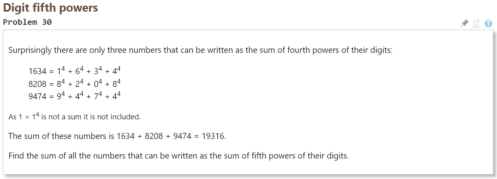

[toc]

## WEEK Ⅰ

### 1.1 输入输出函数说明

> printf 函数

```C
//头文件：
	stdio.h
//原型：
    int printf(const char *fromat, ...);
/*--
--format；格式控制字符串
--... ； 可变参数列表
--返回值：输出字符的数量
--*/
```

>scanf 函数

```c
//头文件：
	stdio.h
//原型：
    int scanf(const char *fromat, ...);
/*--
--format；格式控制字符串
--... ； 可变参数列表
--返回值：成功读入的参数个数
--*/
//循环读入的实现(EOF=-1)：
while (scanf("%d",t) != EOF){
    ...
}
```

>字符串匹配集

```c
#include<stdio.h>

int main() {
    char str[1000]={0};
    scanf("%[^\n]s",str);
    printf("%s\n",str);
    return 0;
}
/*--
--[^\n]：表示读入的只要是非换行符都读入算作一行
--*/
```


## WEEK Ⅱ

### 2.1 printf家族函数

> printf


> sprintf

字符串拼接

```c
#include<iostream>
#include<cstdio>
using namespace std;

int main() {
    char str[100]={0};
    sprintf(str,"%d.%d.%d.%d", 192,169,0,1);
    printf("str = %s\n", str);
    return 0;
}
```


> fprintf

定向输出

```c
 FILE *fout = fopen( "output.txt", "w" );
    fprintf(fout, "%s",str);
//fprintf(stdout,"%s",str)则是标准输出，输出到屏幕上
//fprintf(stdout,"%s",str)标准错误输出
```

标准输出重定向：./.aout > output

### 2.2 欧拉第1题

> 题目描述


> 解法一

```c
#include <stdio.h>

int is_val(int n) {
    return n % 3 == 0 || n % 5 == 0;
}

int main() {
    int sum = 0;
    for (int i = 1; i < 1000; i++) {
        if (is_val(i)) sum += i;
    }
    printf("%d\n", sum);
    return 0;
}
```

> 解法二


通过规律可以发现，所求结果 = 能被3整除 + 能被5整除 - 能被15整除。

```c
#include <stdio.h>

int main() {
    int sum3 = (3 + 999) * 333 / 2;
    int sum5 = (5 + 995) * 199 / 2;
    int sum15 = (15 + 999 / 15 * 15) * (999 / 15) / 2;
    printf("%d\n", sum3 + sum5 - sum15);
    return 0;
}
```


### 2.3 欧拉第6题

> 题目描述


> 解法一

```c
#include <stdio.h>

int main() {
    int sum1 = 0, sum2 = 0;
    for (int i = 1; i <= 100; i++) {
        sum1 += i * i;
        sum2 += i;
    }
    printf("%d\n", sum2 * sum2 - sum1);
    return 0;
}
```

> 解法二

通过立方差公式求解出平方和，通过公式计算

```c
#include <stdio.h>
#define n 100

int main() {
    int sum2 = 5050;
    int sum1 = (2 * n * n * n + 3 * n * n + n) / 6;
    printf("%d\n", sum2 * sum2 - sum1);
    return 0;
}
```


### 2.4 数学运算

> C语言基本运算符

|     运算符     | 说明         | 例子             |
| :------------: | ------------ | ---------------- |
|       =        | 赋值运算符   | a = b;           |
| +、-、*、/、() | 基本四则运算 | a = (b + c) * d; |
|       %        | 求余运算符   | a= b % 2;        |
|  &、\|、^、~   | 位运算       | a = ~b \| c;     |
|     <<、>>     | 左移和右移   | a = b >> 2;      |

循环读入实现除了scanf()==EOF外，还可以~scanf()，二者效果相同 

> C语言中的数学函数库

头文件：math.h

| 常用函数 | 说明                                                         |
| -------- | ------------------------------------------------------------ |
| pow(a,b) | 原型：double **pow**(double a, double b);<br />a：底数   b：指数   返回值：返回a的b次方的值 |
| sqrt(x)  | 原型：double **sqrt**(double x);<br />x：被开方数   返回值：返回根号x的值 |
| ceil(x)  | 原型：double **ceil**(double x);<br />x：某个实数   返回值：x上取整的值 |
| floor(x) | 原型：double **floor**(double x);<br />x：某个实数   返回值：x下取整的值 |
| abs(x)   | 在头文件stdio.h中<br />原型：int **abs** (int x);<br />x：某个整数   返回值：x的绝对值 |
| fabs(x)  | 原型：double **fabs**(double x);<br />x：某个实数   返回值：x的绝对值 |
| log(x)   | 原型：double **log**(double x);<br />x：某个实数   返回值：以e为底对数的值 |
| log10(x) | 原型：double **log10**(double x);<br />x：某个实数   返回值：以10为底对数的值 |
| acos(x)  | 原型：double **acos**(double x);<br />x：角度的弧度值   返回值：arccos(x)的值 |
| ...      | ...                                                          |

> C语言运算符优先级表


说明：

同一优先级的运算符，运算次序由结合方向所决定。

简单记就是：！ > 算术运算符 > 关系运算符 > && > || > 赋值运算符 [4]

[表格摘自百度百科]([https://baike.baidu.com/item/%E8%BF%90%E7%AE%97%E7%AC%A6%E4%BC%98%E5%85%88%E7%BA%A7/4752611?fr=aladdin](https://baike.baidu.com/item/运算符优先级/4752611?fr=aladdin))

> 通过异或运算交换两个s变量数值

```c
#include <stdio.h>

int main() {
    int a, b;
    while (~scanf("%d%d", &a, &b)) {
        int *p = &a;
        (*p)--;
        printf("a = %d, b = %d\n", a, b);
        a ^= b;
        b ^= a;
        a ^= b;
        printf("swap : a = %d, b = %d\n", a, b);
    }
    return 0;
}
```

程序逻辑：

a ^= b;	a = a0 ^ b0					b = b0;

b ^= a;	a = a0 ^ b0					b = a0 ^ b0 ^b0 = a0;

a ^= b;	a = a0 ^ b0 ^ a0 = b0	b = a0;

交换完成！

### 2.5 inttypes.h头文件讲解

[cppreference关于inttypes.h的说明](https://en.cppreference.com/w/c/types/integer)

```c
#include <stdio.h>
#include <inttypes.h>

int main() {
    //int的三种类型，分别占位32bit，64bit，8bit
    int32_t a = 123;
    int64_t b = 256;
    int8_t c = 123;
    printf("a = %lu, b = %lu\n", sizeof(a), sizeof(b));
    printf("c = %" PRId8 "\n", c);
    printf("sizeof(c) = %" PRIu64 "\n", sizeof(c));
    //依次输出32bit，16bit，8bit所能表示的最大数和最小数
    printf("INT32_MIN = %d\n", INT32_MIN);
    printf("INT32_MAX = %d\n", INT32_MAX);
    printf("INT16_MIN = %d\n", INT16_MIN);
    printf("INT16_MAX = %d\n", INT16_MAX);
    printf("INT8_MIN = %d\n", INT8_MIN);
    printf("INT8_MAX = %d\n", INT8_MAX);
    //通过宏表示占位符
    printf("PRId64 = %s\n", PRId64);
    printf("PRId32 = %s\n", PRId32);
    printf("PRId16 = %s\n", PRId16);
    return 0;
}
```


### 2.6 欧拉第28题

> 题目描述


> 解法一

令每一圈的正方形边长为L，则


即四个角的和为4\*L\*L-6*L+6

```
#include <stdio.h>

int main() {
    int sum = 1;
    for (int l = 3; l <= 1001; l += 2) {
        sum += 4 * l * l - 6 * l + 6;
    }
    printf("%d\n", sum);
    return 0;
}
```

> 解法二

根据之前的求和公式，直接求和可直接计算出结果

### 2.7 欧拉第30题

> 题目描述



> 解法

首先通过函数寻找循环的上限


而后通过循环进行查找，累加

```c
#include <stdio.h>
#include <math.h>

const int N = pow(9, 5) * 6;

int val(int n) {
    int sum = 0, tmp = n;
    while (tmp) {
        sum += pow(tmp % 10, 5);
        tmp /= 10;
    }
    return sum == n;
}

int main() {
    int sum = 0;
    for (int i = 2; i <= N; i++) {
        if (!val(i)) continue;
        sum += i;
    }
    printf("%d\n", sum);
    return 0;
}
```


### 2.8 欧拉第4题

> 题目描述


> 解法


```c
#include <stdio.h>

int is_val(int n, int base) {
    int sum = 0, tmp = n;
    while (tmp) {
        sum = sum * base + tmp % base;
        tmp /= base;
    }
    return sum == n;
}

int main() {
    int ans = 0;
    for (int a = 100; a < 1000; a++) {
        for (int b = a; b < 1000; b++) {
            int t = a * b;
            if (t > ans && is_val(t, 10)) ans = t;
        }
    }
    printf("%d\n", ans);
    return 0;
}
```

### 2.9  分支结构

> CPU分支预测

用于分支预测的宏：


> 程序流程控制代码演示

```c
#include <stdio.h>
#include <stdlib.h>
#include <time.h>

int main() {
    int a = 0, b = 0;
    if ((a++) && (b++)) {
        printf("true\n");
    } else {
        printf("false\n");
    }
    //a = 1; b = 0;
    printf("test1 : a = %d, b = %d\n", a, b);
    if ((a++) || (b++)) {
        printf("true\n");
    } else {
        printf("false\n");
    }
    //a = 2; b = 0;
    printf("test2 : a = %d, b = %d\n", a, b);
    int n, cnt = 0;
    scanf("%d", &n);
    //生成随机种子
    srand(time(0));
    if (n & 1) {
        printf("%d is a odd!\n", n);
    } else {
        printf("%d is a even!\n", n);
    }
    for (int i = 0; i < n; i++) {
        //生成范围为0~100的随机数
        int val = rand() % 100;
        i && printf(" ");
        printf("%d", val);
        cnt += (val & 1);
    }
    printf("\n");
    printf("odd nums : %d\n", cnt);
    int x, digits = 0;
    scanf("%d", &x);
    //注意while和dowhile循环的差异
    do {
        digits++;
        x /= 10;
    } while (x);
    printf("digits : %d\n", digits);
    return 0;
}
```

### 2.10 欧拉第2题

